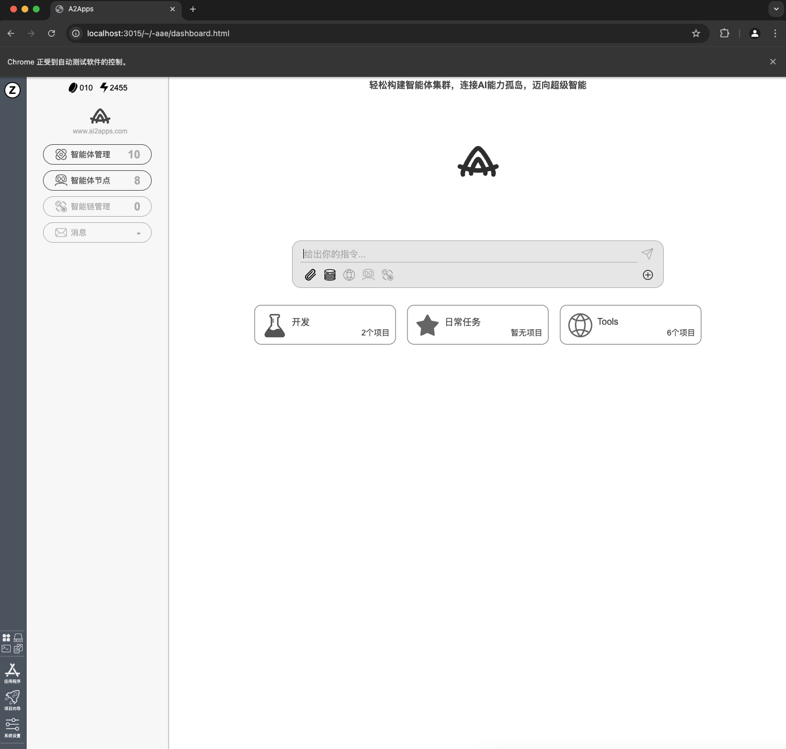

<a name="readme-top">

# AI2Apps-user-manual  

[English](./README.md) 

## 🚀 快速开始
AI2Apps可以直接在网页中使用，也可以用本项目部署在本地使用。

### 1. 直接使用网页版

用桌面浏览器访问： [https://www.ai2apps.com](https://www.ai2apps.com)  

> 第一次打开网页会进行开发环境安装与配置，根据浏览器以及网络的不同，大概需要几秒到1分钟的时间。

> 测试期间，要访问 AI 模型，需要注册并登录 Tab-OS（注册 Tab-OS 账号完全免费）。成功注册/登录后，就可以使用项目向导就创建 AI Agent 项目了。

> 浏览器访问AI2Apps的功能限制：不支持RPA、不支持部署本地AI项目。如若想体验这些功能，请在本地部署AI2Apps。

### 2. 部署本地环境

- 安装 [Anaconda](https://www.anaconda.com/) 

- 下载 [AI2Apps Demo](https://github.com/Avdpro/ai2apps)

```bash
git clone https://github.com/Avdpro/ai2apps.git
```

- 修改.env文件，配置正确的OpenAI Key以及服务端口，默认的端口是3015。

```
APIROOT=https://www.ai2apps.com/ws/
OPENAI_API_KEY=sk-XXXXXXXXXXXXXXXXXXXXXXXXXXXXXXXXXXXXXXXXXXXXXXXX
PORT=3015

# 注释解除
AAF_EXECUATABLE=/Applications/Google Chrome.app/Contents/MacOS/Google Chrome
```

- 安装依赖

```bash
cd ai2apps
npm install
```

```bash
cd agents
pip install -r requirements.txt
```

- 启动项目

```bash
cd ai2apps
node ./start.js
```
> 当ai2apps项目启动成功后，浏览器将自动打开dashboard页面。



## 👋 入门指南

- [简单对话](./doc/simple-chat-zh_CN.md)
- [创建智能体](./doc/create_project-zh_CN.md)
- [查找已创建的智能体](./doc/find_project-zh_CN.md)
- [使用 IDE](./doc/write_agent-zh_CN.md)
- [发布智能体](./doc/publish-agent-zh_CN.md)
- [工具市场](./doc/too_mart-zh_CN.md)
- [可使用的智能体](./doc/example-zh_CN.md)
- [团队协作](./doc/teamwork-zh_CN.md)
- [更新系统](./doc/update_system-zh_CN.md)
- [切换语言](./doc/language-zh_CN.md)

## 💡 常见问题

- [清单](./question-zh_CN.md)

## 🔖 更新日志

- [日志](./CHANGELOG-zh_CN.md)


<div style="display: flex;">
    <span style="margin-right:10px;">
        
        <div>zdq93</div> 
    </span>
    <span style="margin-right:10px;">
        
        <div>zdq93</div> 
    </span>
    <span style="margin-right:10px;">
        
        <div>zdq93</div> 
    </span>
</div>

