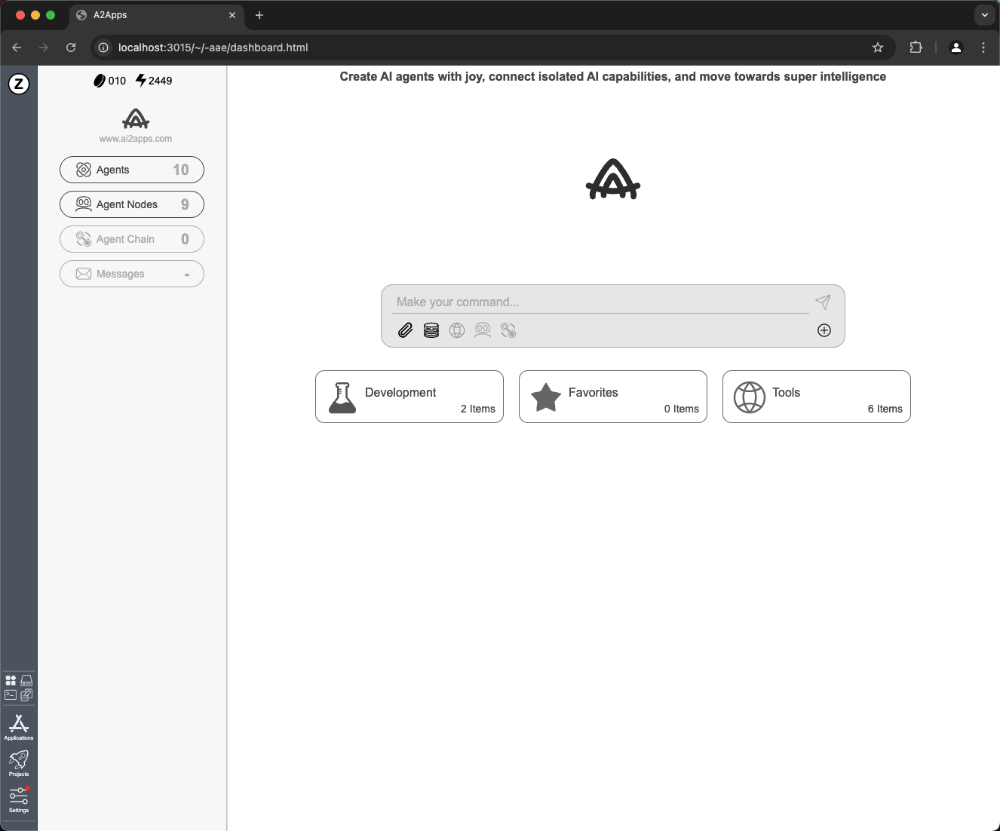

<a name="readme-top">

# AI2Apps-user-manual  

[中文](./README-zh_CN.md) 

## 🚀 Quick Start
AI2Apps can be used directly via Web Browser or deployed locally using this project.

### 1. Direct Use via Web Browser

Accessed with a desktop browser: [https://www.ai2apps.com](https://www.ai2apps.com)  

> When you first open the webpage, the development environment will install and set up. Depending on your browser and internet speed, this process usually takes from a few seconds to one minute.

> During testing, accessing AI models requires registering and logging into Tab-OS (signing up for a Tab-OS account is completely free). Once you successfully register or log in, you can use the project wizard to create AI Agent projects.

### 2. Local Deployment

- Install [Anaconda](https://www.anaconda.com/) 

- Download [AI2Apps Demo](https://github.com/Avdpro/ai2apps)

```bash
git clone https://github.com/Avdpro/ai2apps.git
```
- Edit the `.env` file and configure the correct OpenAI Key and server port. The default port is 3015:

```
APIROOT=https://www.ai2apps.com/ws/
OPENAI_API_KEY=sk-XXXXXXXXXXXXXXXXXXXXXXXXXXXXXXXXXXXXXXXXXXXXXXXX
PORT=3015

AAF_EXECUATABLE=/Applications/Google Chrome.app/Contents/MacOS/Google Chrome
```

- Install dependecies

```bash
cd ai2apps
npm install
```

```bash
cd agents
pip install -r requirements.txt
```

- Start service

```bash
cd ai2apps
node ./start.js
```
> When ai2apps service starts, the web browser will automatically open the dashboard page: `http://localhost:3015/`.



## 👋 Getting Started

- [Basic Chat](./doc/simple-chat.md)
- [Create Agent](./doc/create_project.md)
- [Find Created Agent](./doc/find_project.md)
- [Use IDE](./doc/write_agent.md)
- [Use Components](./doc/component.md)
- [Teamwork](./doc/teamwork.md)
- [Update System](./doc/update_system.md)
- [Switch Language](./doc/language.md)

## 💡 Q&A

- [List](./question.md)

## 🔖 Changelog

- [Log](./CHANGELOG.md)