# 🧩 使用组件

## 常用

### 聊天输入 

作用：用户聊天输入。

#### 1. 基础操作

在组件工具栏中，鼠标左键点击`聊天输入`，右侧画布则会显示`聊天输入`组件。

    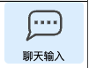

在焦点处输入组件名称，如 **UserInput**，再按下 `enter` 键，即可为组件命名。

    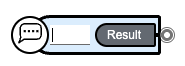
    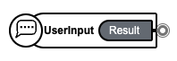

鼠标右键点击组件，组件下方将显示菜单选项，分别为`选择右侧相关组件`、`删除组件`、`设置组件标记`。

    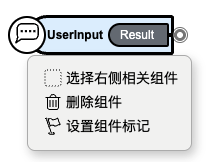

鼠标左键点击组件，右侧会显示相应的对象属性面板。

    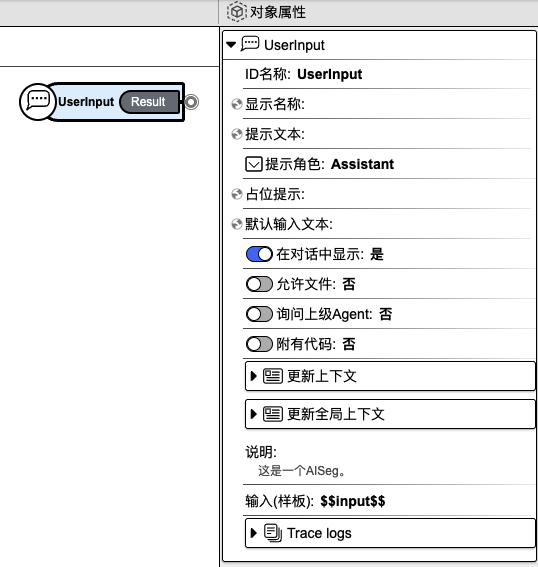

#### 2. 对象属性详解

**ID 名称**：该组件的唯一标识，不可重复，建议用英文命名。

**显示名称**：该组件的展示名称。

**提示文本**：可用作提示用户输入的引导语。

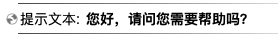

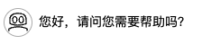

**提示角色**：用于设置提示文本所相应的角色。

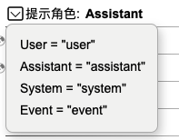

**占位提示**：输入框内的默认提示内容。

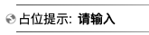

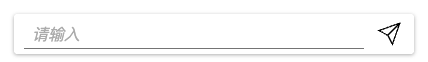

**默认输入文本**：输入框内的默认的占位内容。

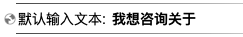

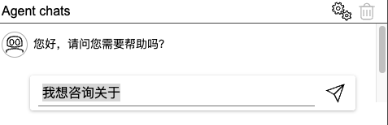

**在对话中显示**：用于设置输入框内容是否在对话过程中进行展示。假设用户输入内容为**这是测试数据**，选择`是`，则代表在对话过程中显示该输入内容，如下图所示；选择`否`，则代表不显示该输入内容。

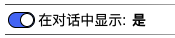

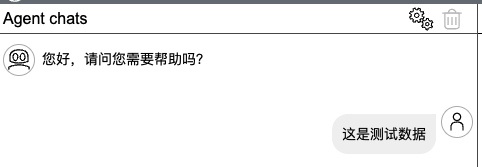

**允许文件**：用户可设置是否上传附件。选择`是`，则代表用户在输入过程中可以上传附件；选择`否`，则只能输入文字，无法上传额外附件内容。

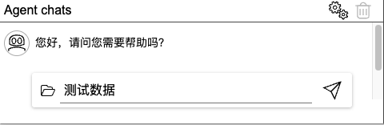

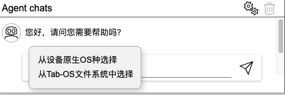

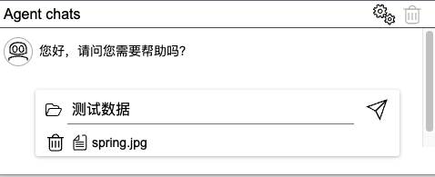

**询问上级 Agent**：选项值为`是`或`否`。

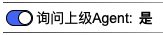

**附有代码**：可在代码指定编辑区域内添加代码。选择`是`，则代表用户可以添加代码；选择`否`，则无法添加代码。

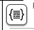

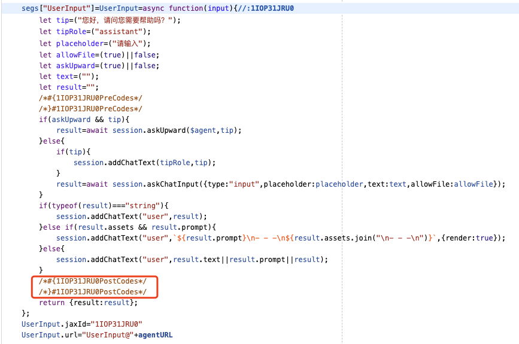

**更新上下文**：用于设置变量名与变量值，可在其他组件中使用。点击右侧**加号**按钮，选择`数据类型`，填写`变量名`和`变量值`，即可进行上下文设置。另外，点击`变量映射`旁边的**箭头**图标，会显示上下文变量名列表，在变量名后面填写对应的值，即可完成上下文值的更新。该值可以来源于上一个组件或当前组件的输出，**input** 表示为当前组件的输入，也可以称之为上一个组件的输出，**result** 表示为当前组件的输出。当前设置也可以在代码编辑区域内进行查看或修改。

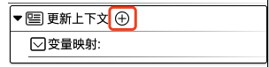

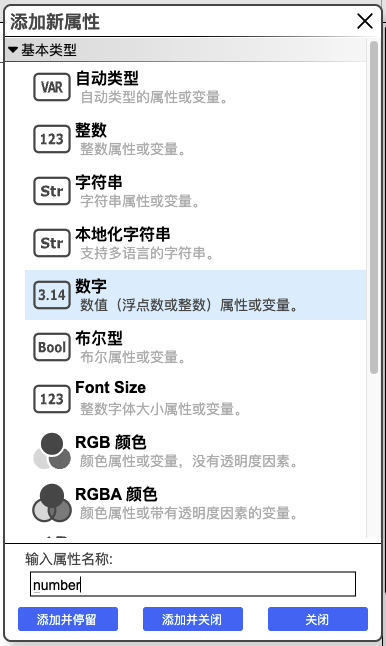

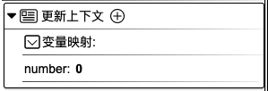

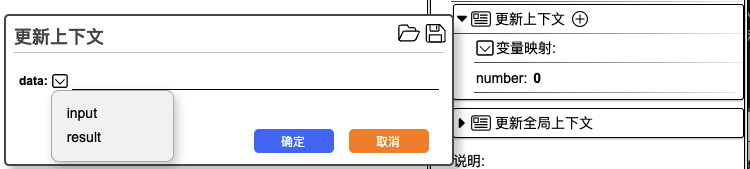

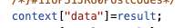

**更新全局上下文**：用于设置全局使用的变量。使用方法请参考`更新上下文`。

**说明**：对该组件的辅助说明。

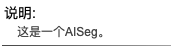

**Trace logs**：当前组件运行的日志。

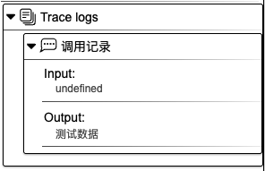

### 调用LLM

作用：调用AI模型。

#### 1. 基础操作

请参考[ 聊天输入 ](#聊天输入)。

#### 2. 对象属性详解

**ID 名称**：该组件的唯一标识，不可重复，建议用英文命名。

**显示名称**：该组件的展示名称。

<!-- **输入（样板）**： -->

**AI 平台**：

**AI 模型**：

**调用参数**：用于设置模型参数。

**系统设定**：用于编写提示语。

**预置对话**：

**提示（Prompt）**：可用作指定输出内容的格式。

**高级设置**：

**附有代码**：可在代码指定编辑区域内添加代码。选择`是`，则代表用户可以添加代码；选择`否`，则无法添加代码。

**说明**：对该组件的辅助说明。

**Trace logs**：当前组件运行的日志。

### 文本输出

作用：显示结果或用作提示语展示。

#### 1. 基础操作

请参考[ 聊天输入 ](#聊天输入)。

#### 2. 对象属性详解

**ID 名称**：该组件的唯一标识，不可重复，建议用英文命名。

**显示名称**：该组件的展示名称。

<!-- **输入（样板）**： -->

**角色**：用于设置文本所相应的角色。

**输出内容**：当前组件对外显示的内容。

**附有代码**：可在代码指定编辑区域内添加代码。选择`是`，则代表用户可以添加代码；选择`否`，则无法添加代码。

**更新上下文**：用于设置变量名与变量值，可在其他组件中使用。点击右侧**加号**按钮，选择`数据类型`，填写`变量名`和`变量值`，即可进行上下文设置。另外，点击`变量映射`旁边的**箭头**图标，会显示上下文变量名列表，在变量名后面填写对应的值，即可完成上下文值的更新。该值可以来源于上一个组件或当前组件的输出，**input** 表示为当前组件的输入，也可以称之为上一个组件的输出，**result** 表示为当前组件的输出。当前设置也可以在代码编辑区域内进行查看或修改。

**更新全局上下文**：用于设置全局使用的变量。使用方法请参考`更新上下文`。

**说明**：对该组件的辅助说明。

**Trace logs**：当前组件运行的日志。

### 按钮询问

作用：方便用户不同操作选择。

#### 1. 基础操作

在组件工具栏中，鼠标左键点击`按钮询问`，右侧画布则会显示`按钮询问`组件。
在焦点处输入组件名称，如 **Btn**，再按下 `enter` 键，即可为组件命名。

    
    
    

组件中最多可包含3个子按钮。选中其中一个，按下 `del` 键，点击`确定`即可进行删除。

    

选中组件，组件右下角会显示一个**加号**按钮，点击该按钮即可添加新的子按钮。

    

鼠标左键点击父组件、子按钮，右侧会显示相应的对象属性面板。

#### 2. 对象属性详解

##### 2.1 父组件对象属性：

**ID 名称**：该组件的唯一标识，不可重复，建议用英文命名。

**显示名称**：该组件的展示名称。

<!-- **输入（样板）**： -->

**提示文本**：可用作提示用户选择的引导语。

<!-- **Silent**：

**Silent outlet**：

 -->

**倒计时**：开启倒计时，在规定的时间内，按钮选项消失。

**附有代码**：可在代码指定编辑区域内添加代码。选择`是`，则代表用户可以添加代码；选择`否`，则无法添加代码。

**说明**：对该组件的辅助说明。

**Trace logs**：当前组件运行的日志。

##### 2.2 子按钮对象属性：

**ID 名称**：该组件的唯一标识，不可重复，建议用英文命名。

**文本**：该组件的展示名称。

**输出**：用于组件最终的输出结果。

<!-- **图标**：

**表情符号**： -->

**使用代码**：可在代码指定编辑区域内添加代码。选择`是`，则代表用户可以添加代码；选择`否`，则无法添加代码。

**更新上下文**：用于设置变量名与变量值，可在其他组件中使用。点击右侧**加号**按钮，选择`数据类型`，填写`变量名`和`变量值`，即可进行上下文设置。另外，点击`变量映射`旁边的**箭头**图标，会显示上下文变量名列表，在变量名后面填写对应的值，即可完成上下文值的更新。该值可以来源于上一个组件或当前组件的输出，**input** 表示为当前组件的输入，也可以称之为上一个组件的输出，**result** 表示为当前组件的输出。当前设置也可以在代码编辑区域内进行查看或修改。

**更新全局上下文**：用于设置全局使用的变量。使用方法请参考`更新上下文`。

**说明**：对该组件的辅助说明。

### 连接器

作用：组件与组件间的连接。

#### 1. 基础操作

在组件工具栏中，鼠标左键点击`连接器`，右侧画布则会显示`连接器`组件。

    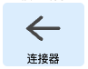
    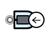

#### 2. 对象属性详解

    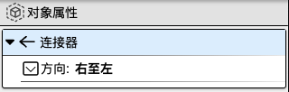

<!-- ### 条件分支

作用：用于不同条件判断。

#### 1. 基础操作

#### 2. 对象属性详解

### 代码片段
### 调用AI-Agent
### 注释 -->

<!-- 
branch
code seg
call ai agent
note -->

  <a href="../README-zh_CN.md">
    🔗 返回主页
  </a>

