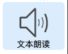
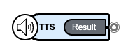
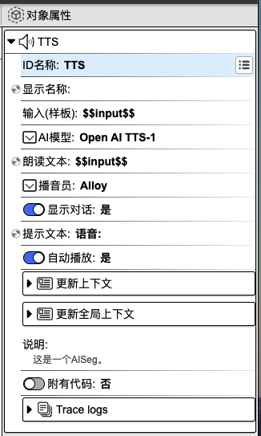
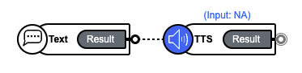
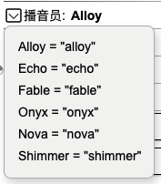

## 文本朗读

作用：将文字转为语音。

### 1. 基础操作

在组件工具栏中，鼠标左键点击`文本朗读`，右侧画布则会显示`文本朗读`组件。

在焦点处输入组件名称，如 **TTS**，再按下 `enter` 键，即可为组件命名。

### 2. 对象属性详解

鼠标左键点击组件，右侧会显示相应的对象属性面板。

**ID 名称**：该组件的唯一标识，不可重复，建议用英文命名。

**显示名称**：该组件的展示名称。

<!-- **输入（样板）**： -->

**AI 模型**：不同的 AI 解析模型。

**朗读文本**：详细的文本内容。可以在`文本朗读`组件前面添加一个`聊天输入`组件，再输入您想要被转换为语音的文本内容。

**播音员**：可使用的播音员列表。

**显示对话**：可设置对话过程是否显示。

**提示文本**：可用作提示用户选择的引导语。

**自动播放**：可设置是否自动播放语音。

**更新上下文**：用于设置变量名与变量值，可在其他组件中使用。点击右侧**加号**按钮，选择`数据类型`，填写`变量名`和`变量值`，即可进行上下文设置。另外，点击`变量映射`旁边的**箭头**图标，会显示上下文变量名列表，在变量名后面填写对应的值，即可完成上下文值的更新。该值可以来源于上一个组件或当前组件的输出，**input** 表示为当前组件的输入，也可以称之为上一个组件的输出，**result** 表示为当前组件的输出。当前设置也可以在代码编辑区域内进行查看或修改。

**更新全局上下文**：用于设置全局使用的变量。使用方法请参考`更新上下文`。

**说明**：对该组件的辅助说明。

**附有代码**：可在代码指定编辑区域内添加代码。选择`是`，则代表用户可以添加代码；选择`否`，则无法添加代码。

**Trace logs**：当前组件运行的日志。