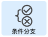
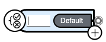
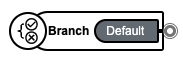
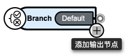
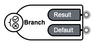
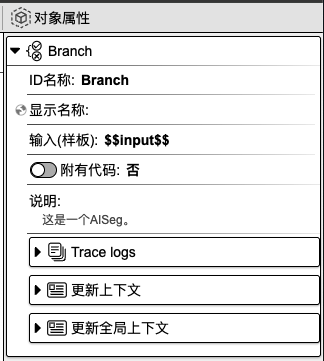
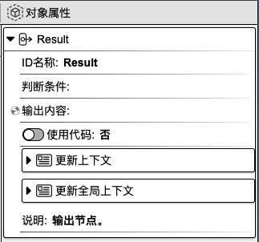
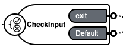
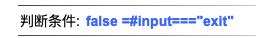

## 条件分支

作用：用于不同条件判断

### 1. 基础操作

在组件工具栏中，鼠标左键点击`条件分支`，右侧画布则会显示`条件分支`组件。

在焦点处输入组件名称，如 **Branche**，再按下 `enter` 键，即可为组件命名。

    
    

点击**加号**按钮可添加新的输出节点。

    
    

### 2. 对象属性详解

鼠标左键点击父组件、子按钮，右侧会显示相应的对象属性面板。

#### 2.1 父组件对象属性

    

**ID 名称**：该组件的唯一标识，不可重复，建议用英文命名。

**显示名称**：该组件的展示名称。

<!-- **输入（样板）**： -->

**附有代码**：可在代码指定编辑区域内添加代码。选择`是`，则代表用户可以添加代码；选择`否`，则无法添加代码。

**说明**：对该组件的辅助说明。

**Trace logs**：当前组件运行的日志。

**更新上下文**：用于设置变量名与变量值，可在其他组件中使用。点击右侧**加号**按钮，选择`数据类型`，填写`变量名`和`变量值`，即可进行上下文设置。另外，点击`变量映射`旁边的**箭头**图标，会显示上下文变量名列表，在变量名后面填写对应的值，即可完成上下文值的更新。该值可以来源于上一个组件或当前组件的输出，**input** 表示为当前组件的输入，也可以称之为上一个组件的输出，**result** 表示为当前组件的输出。当前设置也可以在代码编辑区域内进行查看或修改。

**更新全局上下文**：用于设置全局使用的变量。使用方法请参考`更新上下文`。

#### 2.2 子按钮对象属性

    

**ID 名称**：该组件的标识，建议用英文命名。

**判断条件**：根据用户输入的表达式，程序决定执行哪一条分支路径。例如，判断输入内容是否为**exit**。如果为**exit**，则走`exit`的分支路径；如果不为**exit**，则走`Default`的分支路径。

    
    

**输出内容**：用于设置组件的输出结果。

**使用代码**：可在代码指定编辑区域内添加代码。选择`是`，则代表用户可以添加代码；选择`否`，则无法添加代码。

**更新上下文**：用于设置变量名与变量值，可在其他组件中使用。点击右侧**加号**按钮，选择`数据类型`，填写`变量名`和`变量值`，即可进行上下文设置。另外，点击`变量映射`旁边的**箭头**图标，会显示上下文变量名列表，在变量名后面填写对应的值，即可完成上下文值的更新。该值可以来源于上一个组件或当前组件的输出，**input** 表示为当前组件的输入，也可以称之为上一个组件的输出，**result** 表示为当前组件的输出。当前设置也可以在代码编辑区域内进行查看或修改。

**更新全局上下文**：用于设置全局使用的变量。使用方法请参考`更新上下文`。

**说明**：对该组件的辅助说明。