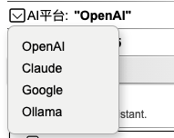
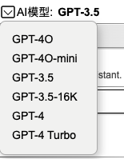
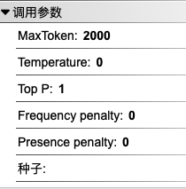
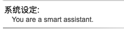
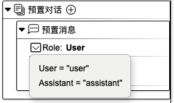
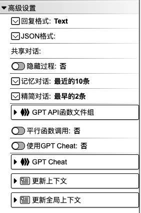

## 调用LLM

作用：调用AI模型。

### 1. 基础操作

请参考 [聊天输入](./user_chat-zh_CN.md)。

### 2. 对象属性详解

**ID 名称**：该组件的唯一标识，不可重复，建议用英文命名。

**显示名称**：该组件的展示名称。

<!-- **输入（样板）**： -->

**AI 平台**：

**AI 模型**：

**调用参数**：用于设置模型参数。

**系统设定**：用于编写提示语。

**预置对话**：

**提示（Prompt）**：可用作指定输出内容的格式。

**高级设置**：

**附有代码**：可在代码指定编辑区域内添加代码。选择`是`，则代表用户可以添加代码；选择`否`，则无法添加代码。

**说明**：对该组件的辅助说明。

**Trace logs**：当前组件运行的日志。

  <a href="../../../README-zh_CN.md">
    🔗 返回主页
  </a>

