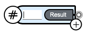
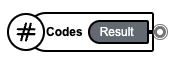
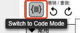
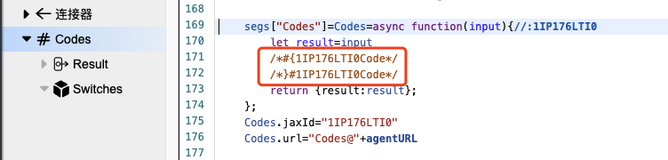
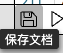
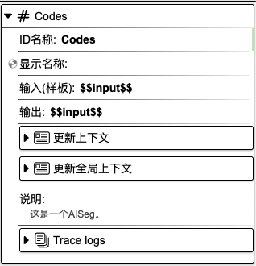

## 代码片段

作用：添加代码。

### 1. 基础操作

在组件工具栏中，鼠标左键点击`代码片段`，右侧画布则会显示`代码片段`组件。

在焦点处输入组件名称，如 **Codes**，再按下 `enter` 键，即可为组件命名。

    
    

点击**代码**按钮，打开代码编辑器，在**Codes**代码片段中添加代码。编辑完成后，点击下方工具栏中的**保存文档**按钮，即可保存代码。

    

    

    

### 2. 对象属性详解

鼠标左键点击组件，右侧会显示相应的对象属性面板。

**ID 名称**：该组件的唯一标识，不可重复，建议用英文命名。

**显示名称**：该组件的展示名称。

<!-- **输入（样板）**： -->

**输出**：用于设置组件的输出结果。

**更新上下文**：用于设置变量名与变量值，可在其他组件中使用。点击右侧**加号**按钮，选择`数据类型`，填写`变量名`和`变量值`，即可进行上下文设置。另外，点击`变量映射`旁边的**箭头**图标，会显示上下文变量名列表，在变量名后面填写对应的值，即可完成上下文值的更新。该值可以来源于上一个组件或当前组件的输出，**input** 表示为当前组件的输入，也可以称之为上一个组件的输出，**result** 表示为当前组件的输出。当前设置也可以在代码编辑区域内进行查看或修改。

**更新全局上下文**：用于设置全局使用的变量。使用方法请参考`更新上下文`。

**说明**：对该组件的辅助说明。

**Trace logs**：当前组件运行的日志。

  <a href="../common/index-zh_CN.md">
    🔗 返回上一页
  </a>

