## 按钮询问

作用：方便用户不同操作选择。

### 1. 基础操作

在组件工具栏中，鼠标左键点击`按钮询问`，右侧画布则会显示`按钮询问`组件。
在焦点处输入组件名称，如 **Btn**，再按下 `enter` 键，即可为组件命名。

    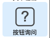
    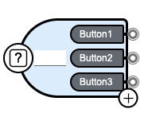
    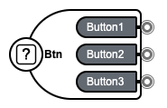

组件中最多可包含3个子按钮。选中其中一个，按下 `del` 键，点击`确定`即可进行删除。

    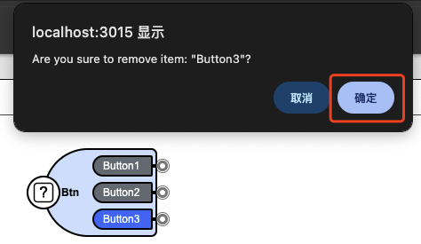

选中组件，组件右下角会显示一个**加号**按钮，点击该按钮即可添加新的子按钮。

    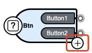

鼠标左键点击父组件、子按钮，右侧会显示相应的对象属性面板。

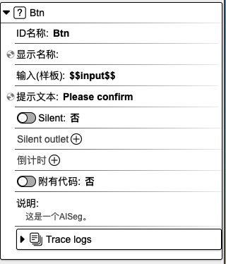

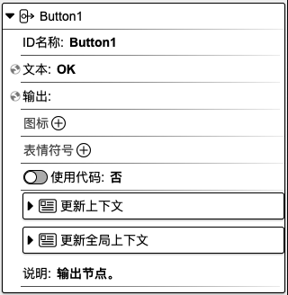

### 2. 对象属性详解

#### 2.1 父组件对象属性：

**ID 名称**：该组件的唯一标识，不可重复，建议用英文命名。

**显示名称**：该组件的展示名称。

<!-- **输入（样板）**： -->

**提示文本**：可用作提示用户选择的引导语。

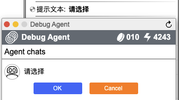

<!-- **Silent**：

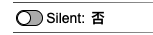

**Silent outlet**：

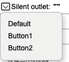
 -->

**倒计时**：开启倒计时，在规定的时间内，按钮选项消失。

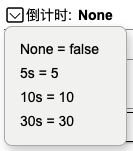

**附有代码**：可在代码指定编辑区域内添加代码。选择`是`，则代表用户可以添加代码；选择`否`，则无法添加代码。

**说明**：对该组件的辅助说明。

**Trace logs**：当前组件运行的日志。

#### 2.2 子按钮对象属性：

**ID 名称**：该组件的唯一标识，不可重复，建议用英文命名。

**文本**：该组件的展示名称。

**输出**：用于组件最终的输出结果。

<!-- **图标**：

**表情符号**： -->

**使用代码**：可在代码指定编辑区域内添加代码。选择`是`，则代表用户可以添加代码；选择`否`，则无法添加代码。

**更新上下文**：用于设置变量名与变量值，可在其他组件中使用。点击右侧**加号**按钮，选择`数据类型`，填写`变量名`和`变量值`，即可进行上下文设置。另外，点击`变量映射`旁边的**箭头**图标，会显示上下文变量名列表，在变量名后面填写对应的值，即可完成上下文值的更新。该值可以来源于上一个组件或当前组件的输出，**input** 表示为当前组件的输入，也可以称之为上一个组件的输出，**result** 表示为当前组件的输出。当前设置也可以在代码编辑区域内进行查看或修改。

**更新全局上下文**：用于设置全局使用的变量。使用方法请参考`更新上下文`。

**说明**：对该组件的辅助说明。

  <a href="../../../README-zh_CN.md">
    🔗 返回主页
  </a>

