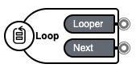
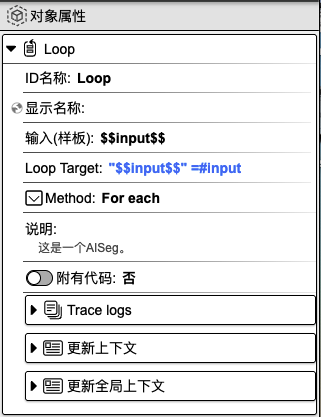
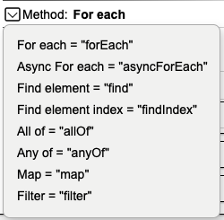

## 遍历数组

作用：可用于循环调用 API 或循环数组。

### 1. 基础操作

在组件工具栏中，鼠标左键点击`遍历数组`，右侧画布则会显示`遍历数组`组件。在焦点处输入组件名称，如 **Loop**，再按下 `enter` 键，即可为组件命名。其中，**Looper** 部分表示遍历的单个数据，**Next** 表示遍历结束。

### 2. 对象属性详解

**ID 名称**：该组件的唯一标识，不可重复，建议用英文命名。

**显示名称**：该组件的展示名称。

<!-- **输入（样板）**： -->

**Loop Target**：具体的遍历对象。

**Method**：可根据具体需求，选择不同的遍历方法。

**说明**：对该组件的辅助说明。

**附有代码**：可在代码指定编辑区域内添加代码。选择`是`，则代表用户可以添加代码；选择`否`，则无法添加代码。

**Trace logs**：当前组件运行的日志。

**更新上下文**：用于设置变量名与变量值，可在其他组件中使用。点击右侧**加号**按钮，选择`数据类型`，填写`变量名`和`变量值`，即可进行上下文设置。另外，点击`变量映射`旁边的**箭头**图标，会显示上下文变量名列表，在变量名后面填写对应的值，即可完成上下文值的更新。该值可以来源于上一个组件或当前组件的输出，**input** 表示为当前组件的输入，也可以称之为上一个组件的输出，**result** 表示为当前组件的输出。当前设置也可以在代码编辑区域内进行查看或修改。

**更新全局上下文**：用于设置全局使用的变量。使用方法请参考`更新上下文`。

  <a href="../flow_control/index-zh_CN.md">
    🔗 返回上一页
  </a>

