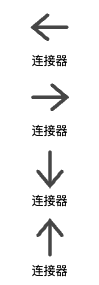
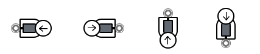
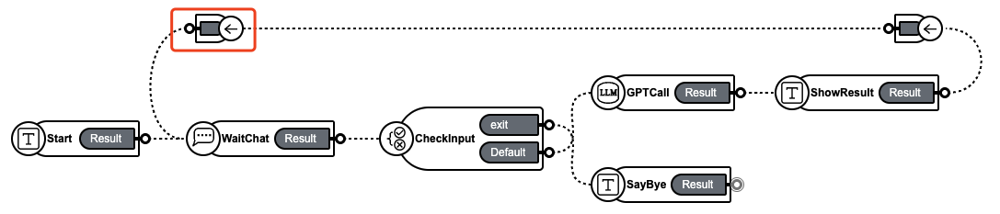
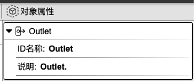

## 连接器

作用： 辅助组件之间不同方向的连接。

### 1. 基础操作

在组件工具栏中，鼠标左键点击`连接器`，右侧画布则会显示`连接器`组件。在组件圆圈处进行拖拽，与其他组件进行连接即可。

### 2. 对象属性详解

鼠标左键点击组件，右侧会显示相应的对象属性面板。

  <a href="../flow_control/index-zh_CN.md">
    🔗 返回上一页
  </a>

