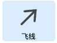
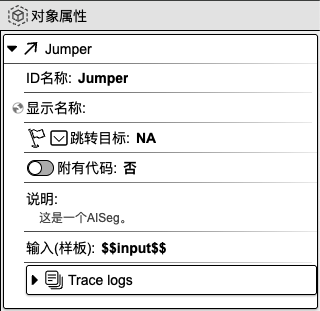

## 飞线

作用：适用于跨组件连接。

### 1. 基础操作

在组件工具栏中，鼠标左键点击`飞线`，右侧画布则会显示`飞线`组件。在焦点处输入组件名称，如 **Jumper**，再按下 `enter` 键，即可为组件命名。

### 2. 对象属性详解

鼠标左键点击组件，右侧会显示相应的对象属性面板。

  <a href="../flow_control/index-zh_CN.md">
    🔗 返回上一页
  </a>

