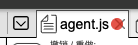
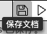

# 🧩 组件

- [常用](./common/index-zh_CN.md)

- [AI 调用](./AI_call/index-zh_CN.md)

<!-- 
- [交互/输出](./interactive-zh_CN.md)
- [流程控制](./flow_control-zh_CN.md)
- [代码](./code-zh_CN.md) 
-->
----------

**⚠️ 注意**：

> **组件、代码**一旦发生变更，页面顶部会显示红色圆圈（如下图所示），代表之前的更新没有被保存。

  

> 您可以点击页面底部的`保存文档`按钮，也可以按下快捷键 `cmd+s` 或 `ctrl+s`进行保存。

  

  <a href="../../README-zh_CN.md">
    🔗 返回主页
  </a>

