## 编辑对象

作用：方便用户设计问题列表。

### 1. 基础操作

- 首先，
在组件工具栏中，鼠标左键点击`编辑对象`，右侧画布则会显示`编辑对象`组件。在焦点处输入组件名称，如 **Data**，再按下 `enter` 键，即可为组件命名。
    

    
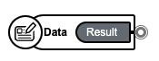

- 接着，
点击左侧菜单下方第二个`火箭`按钮，在`数据模块`中添加文件。点击`创建新文件`选项，命名为**data.js**，点击 `OK` ，文件即可创建成功。
    
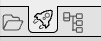

    
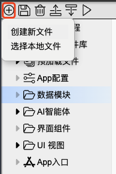

    
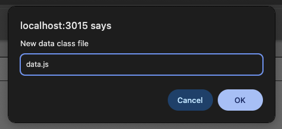

- 然后，
点击左侧菜单下 `data` 区域，右侧区域会显示具体的`对象属性`。点击 `Properties` 进行数据添加，填写`展示展示名称`和`说明`，选择`展示模式`为 **Note** 。
    
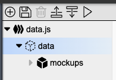

    
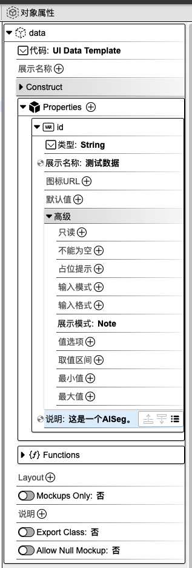

- 其次，
点击左侧菜单下方第一个`文件夹`按钮，回到 **agent.js** 文件。点击 `Data` 组件，右侧会显示其`对象属性`。选择`模版`为 **data** ，`编辑数据`为**是**。
    
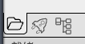

    
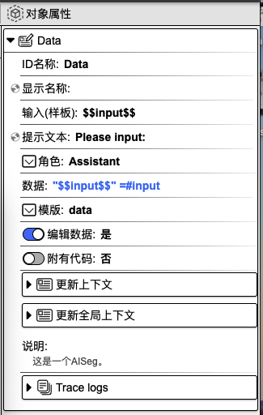

- 另外，
打开`代码区域`，引入数据文件 `import {} from '../data/data.js'`。
    
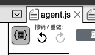

    
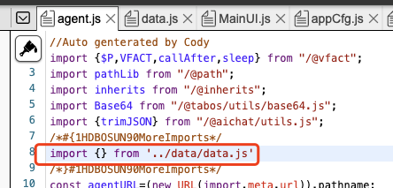

   
- 最后，
点击` AI 智能体`，设置启动入口为**Data**，点击`保存`按钮。点击`调试 Agent`->`确定`，即可运行。
    
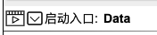

    
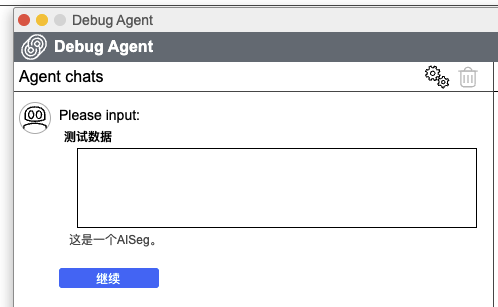

### 2. 对象属性详解

鼠标左键点击组件，右侧会显示相应的对象属性面板。

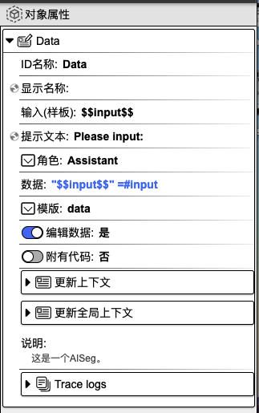

**ID 名称**：该组件的唯一标识，不可重复，建议用英文命名。

**显示名称**：该组件的展示名称。

<!-- **输入（样板）**： -->

**提示文本**：可用作提示用户操作的引导语。

**角色**：用于设置文本所相应的角色。

<!-- **数据**： -->

**模版**：用于设置数据。

**编辑数据**：配合**模板**一起使用。

**附有代码**：可在代码指定编辑区域内添加代码。选择`是`，则代表用户可以添加代码；选择`否`，则无法添加代码。

**更新上下文**：用于设置变量名与变量值，可在其他组件中使用。点击右侧**加号**按钮，选择`数据类型`，填写`变量名`和`变量值`，即可进行上下文设置。另外，点击`变量映射`旁边的**箭头**图标，会显示上下文变量名列表，在变量名后面填写对应的值，即可完成上下文值的更新。该值可以来源于上一个组件或当前组件的输出，**input** 表示为当前组件的输入，也可以称之为上一个组件的输出，**result** 表示为当前组件的输出。当前设置也可以在代码编辑区域内进行查看或修改。

**更新全局上下文**：用于设置全局使用的变量。使用方法请参考`更新上下文`。

**说明**：对该组件的辅助说明。

**Trace logs**：当前组件运行的日志。

  <a href="../../components/interactive/index-zh_CN.md">
    🔗 返回上一页
  </a>

