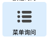
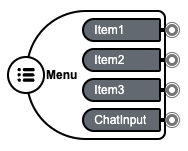
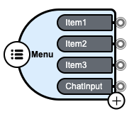
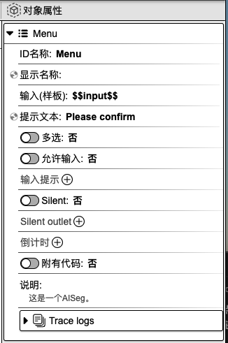
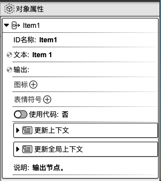

## 菜单询问

作用：方便用户单选或多选。

### 1. 基础操作

在组件工具栏中，鼠标左键点击`菜单询问`，右侧画布则会显示`菜单询问`组件。
在焦点处输入组件名称，如 **Menu**，再按下 `enter` 键，即可为组件命名。

    
    

选中组件，组件右下角会显示一个**加号**按钮，点击该按钮即可添加新的子按钮。

    

### 2. 对象属性详解

鼠标左键点击父组件、子选项，右侧会显示相应的对象属性面板。

#### 2.1 父组件对象属性

    

**ID 名称**：该组件的唯一标识，不可重复，建议用英文命名。

**显示名称**：该组件的展示名称。

<!-- **输入（样板）**： -->

**提示文本**：可用作提示用户选择的引导语。

**多选**：可设置选项为单选或单选。选择`是`，则代表用户可以进行多选；选择`否`，则仅支持单选。

<!-- **允许输入**：
**输入提示**： -->
<!-- **Silent**：
**Silent outlet**： -->

**倒计时**：开启倒计时，在规定的时间内，菜单选项消失。

**附有代码**：可在代码指定编辑区域内添加代码。选择`是`，则代表用户可以添加代码；选择`否`，则无法添加代码。

**说明**：对该组件的辅助说明。

**Trace logs**：当前组件运行的日志。

#### 2.2 子选项对象属性

    

**ID 名称**：该组件的标识，建议用英文命名。

**文本**：该组件的展示名称。

**输出**：用于组件最终的输出结果。

<!-- **图标**：
**表情符号**： -->

**使用代码**：可在代码指定编辑区域内添加代码。选择`是`，则代表用户可以添加代码；选择`否`，则无法添加代码。

**更新上下文**：用于设置变量名与变量值，可在其他组件中使用。点击右侧**加号**按钮，选择`数据类型`，填写`变量名`和`变量值`，即可进行上下文设置。另外，点击`变量映射`旁边的**箭头**图标，会显示上下文变量名列表，在变量名后面填写对应的值，即可完成上下文值的更新。该值可以来源于上一个组件或当前组件的输出，**input** 表示为当前组件的输入，也可以称之为上一个组件的输出，**result** 表示为当前组件的输出。当前设置也可以在代码编辑区域内进行查看或修改。

**更新全局上下文**：用于设置全局使用的变量。使用方法请参考`更新上下文`。

**说明**：对该组件的辅助说明。

  <a href="../../components/interactive/index-zh_CN.md">
    🔗 返回上一页
  </a>

