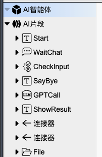
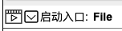
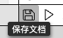
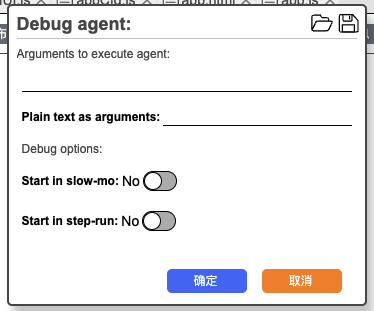
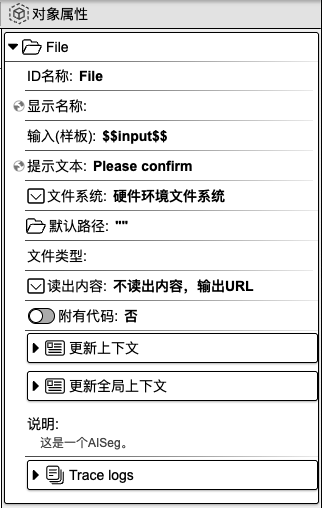
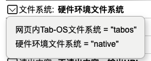
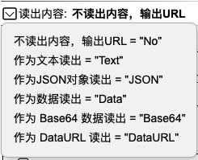

## 打开文件

作用：用于上传本地文件。

### 1. 基础操作

- 首先，
在组件工具栏中，鼠标左键点击`打开文件`，右侧画布则会显示`打开文件`组件。在焦点处输入组件名称，如 **File**，再按下 `enter` 键，即可为组件命名。
    

    

- 接着，
点击` AI 智能体`，设置启动入口为**File**，点击`保存`按钮。
    

    

    

- 然后，
点击`调试 Agent`->`确定`，即可运行。
    

    

- 最后，
Agent启动后，点击文件icon，选择本地文件。
    

### 2. 对象属性详解

鼠标左键点击组件，右侧会显示相应的对象属性面板。

**ID 名称**：该组件的唯一标识，不可重复，建议用英文命名。

**显示名称**：该组件的展示名称。

<!-- **输入（样板）**： -->

**提示文本**：可用作提示用户选择的引导语。

**文件系统**：可选择本地文件或网页内文件。

**文件系统**：可设置文件的默认路径。

**文件类型**：用于设置文件的不同类型。

**读出内容**：用于设置文件最终的输出格式。

**附有代码**：可在代码指定编辑区域内添加代码。选择`是`，则代表用户可以添加代码；选择`否`，则无法添加代码。

**更新上下文**：用于设置变量名与变量值，可在其他组件中使用。点击右侧**加号**按钮，选择`数据类型`，填写`变量名`和`变量值`，即可进行上下文设置。另外，点击`变量映射`旁边的**箭头**图标，会显示上下文变量名列表，在变量名后面填写对应的值，即可完成上下文值的更新。该值可以来源于上一个组件或当前组件的输出，**input** 表示为当前组件的输入，也可以称之为上一个组件的输出，**result** 表示为当前组件的输出。当前设置也可以在代码编辑区域内进行查看或修改。

**更新全局上下文**：用于设置全局使用的变量。使用方法请参考`更新上下文`。

**说明**：对该组件的辅助说明。

**Trace logs**：当前组件运行的日志。

  <a href="../../components/interactive/index-zh_CN.md">
    🔗 返回上一页
  </a>

