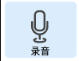
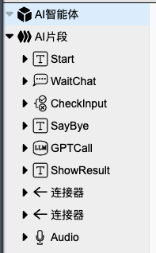
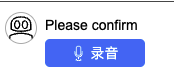
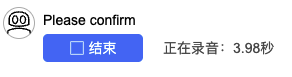
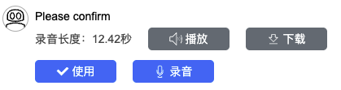

## 录音

作用：方便用户发送语音内容。

### 1. 基础操作

- 首先，
在组件工具栏中，鼠标左键点击`录音`，右侧画布则会显示`录音`组件。在焦点处输入组件名称，如 **Audio**，再按下 `enter` 键，即可为组件命名。
    

    

- 接着，
点击` AI 智能体`，设置启动入口为**Audio**，点击`保存`按钮。  
    

    

    

- 然后，
点击`调试 Agent`->`确定`，即可运行。
    

    

- 最后，
Agent启动后，点击`录音`，
    

    

    

