## 📝 创建项目 

点击`开发`->`新建开发工程`，选择项目类型。

    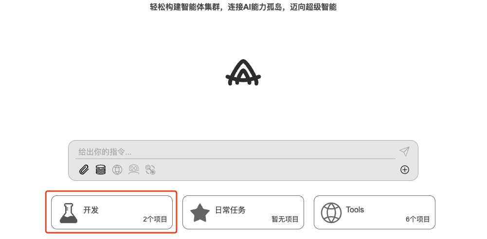
    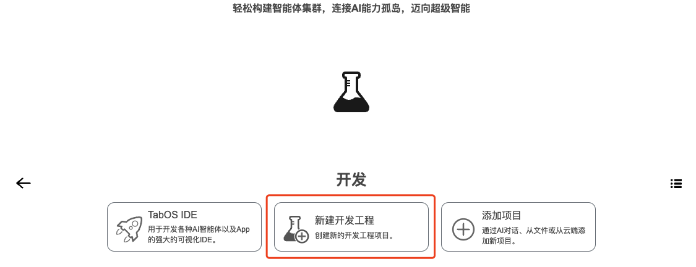

### 👇 参考示例

#### 1. 创建网页端运行的 AI 智能体

点击`网页端运行的 AI 智能体应用`->`简单的 AI Agent应用`->输入框内输入项目名称（例如：TestDemo1）->`创建`，项目创建成功。

    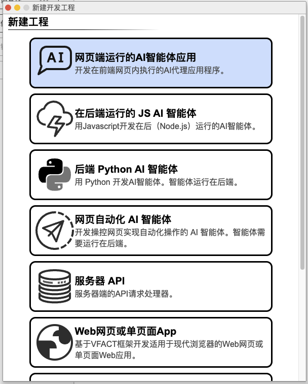
    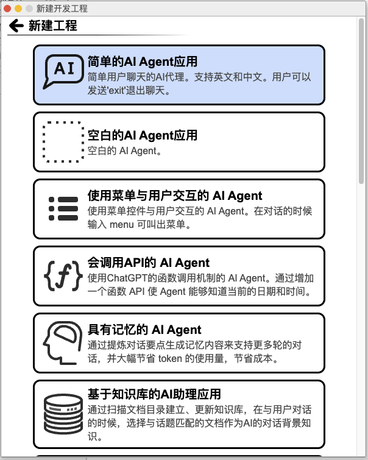
    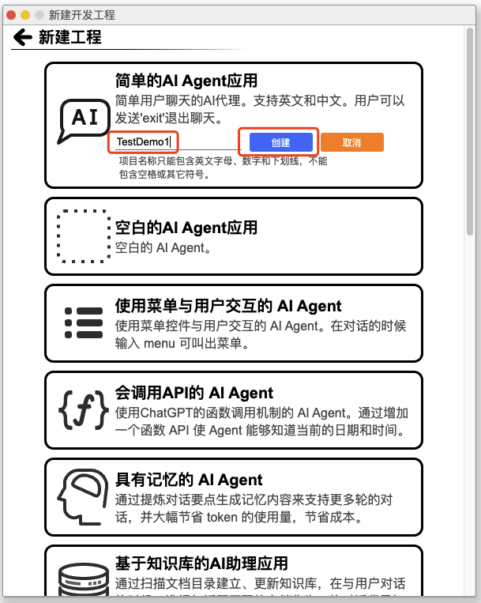

在弹出页面，选择`在IDE中打开工程`，自动打开项目。

    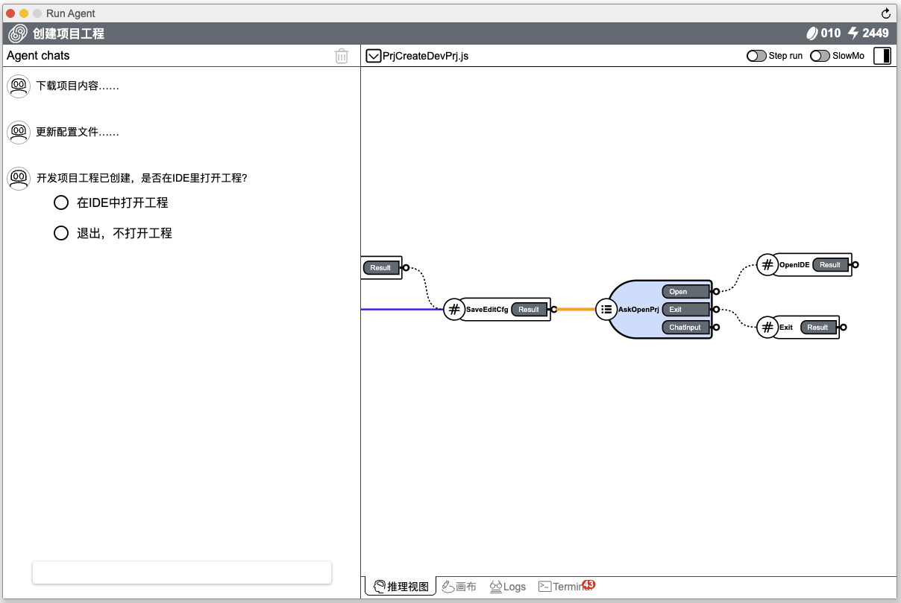
    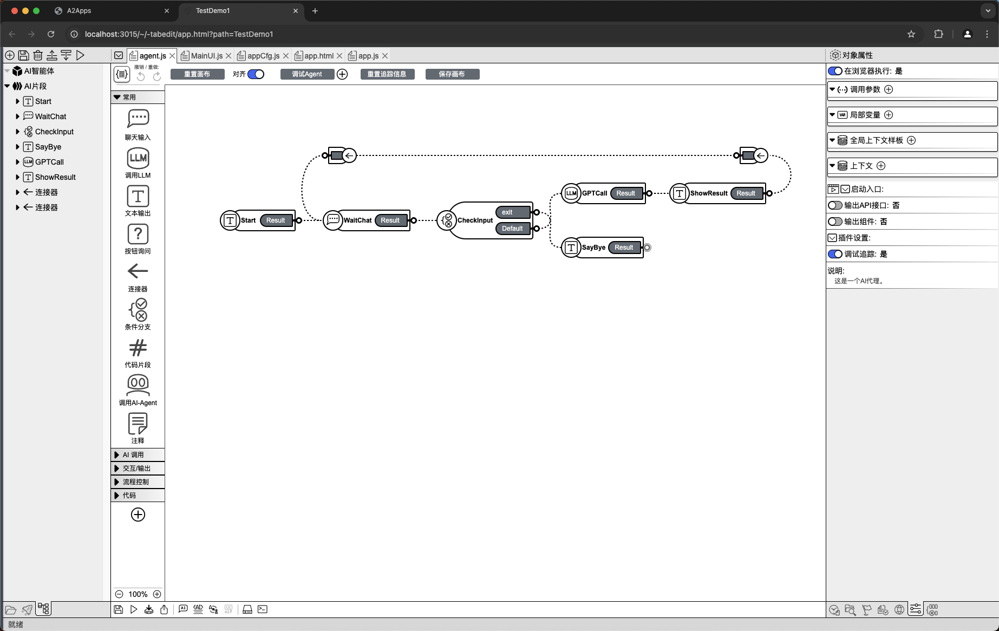

点击`调试 Agent `->`确定`，Agent启动成功。

    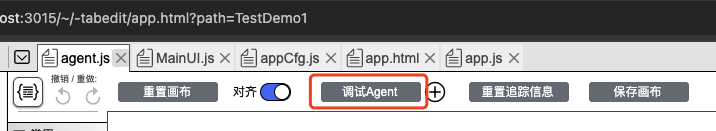
    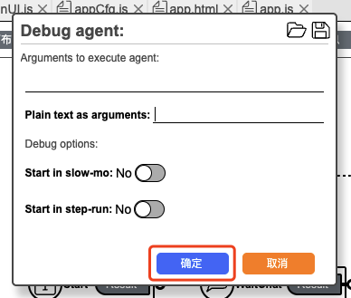
    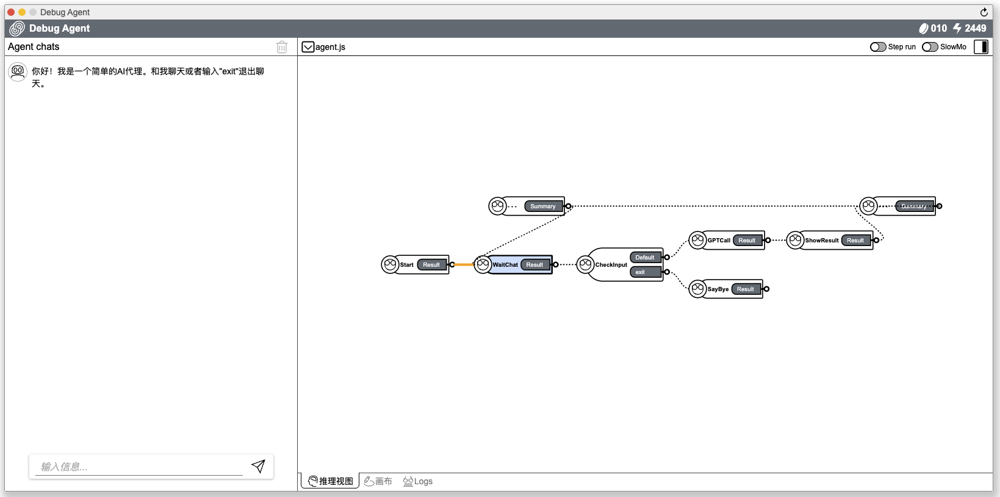

#### 2. 创建 Python AI 智能体

点击`后端 Python AI 智能体`->`空的 Python AI Agent`->输入框内输入项目名称（例如：TestDemo2）->`创建`，项目创建成功。

    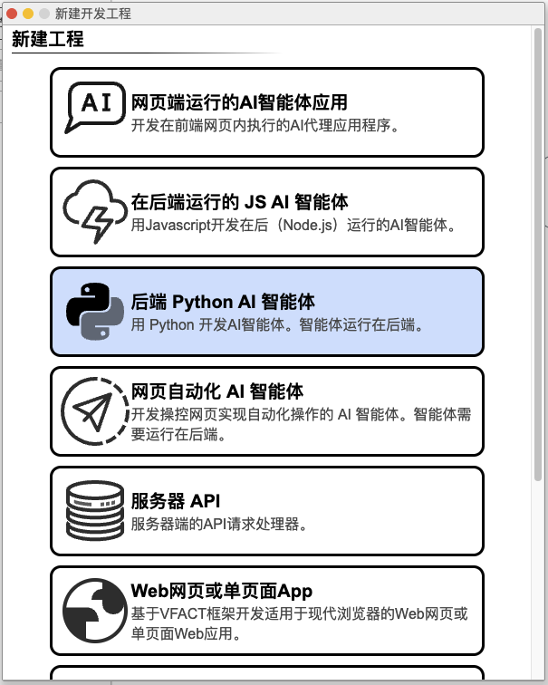
    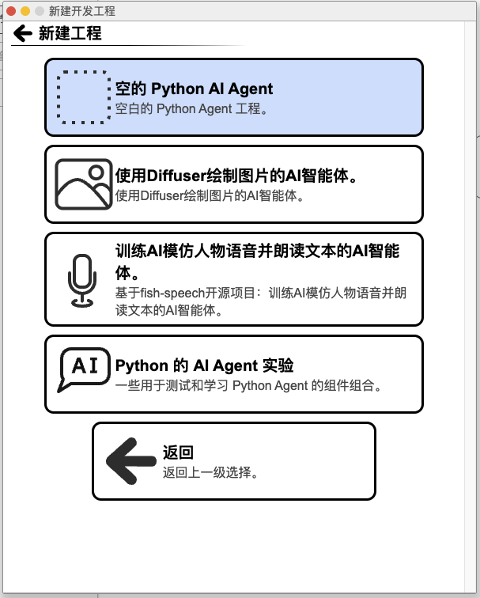
    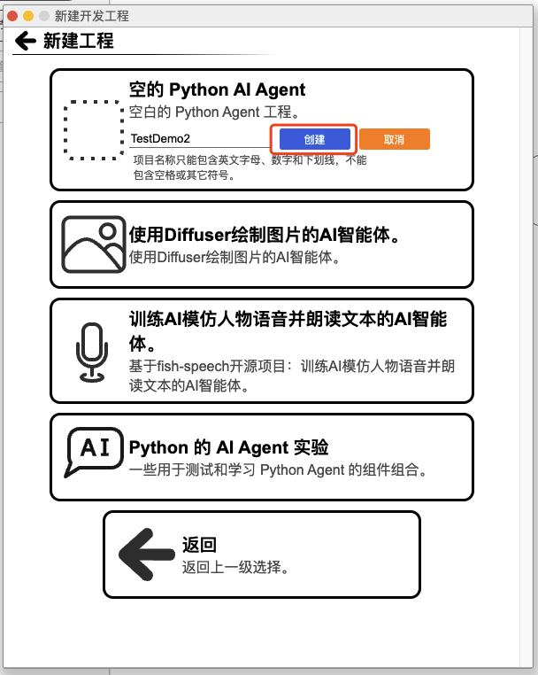

在弹出页面，选择`在IDE中打开工程`，自动打开项目。

    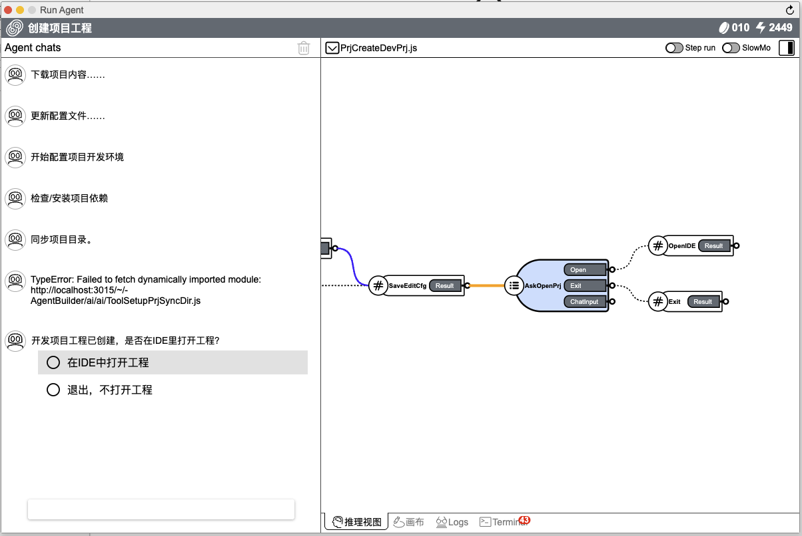
    

在页面底部工具栏区域，点击`与设备目录同步`按钮，在弹出框内Sync target一栏输入`AGENTS/TestDemo2`，点击`同步`按钮，再点击`确认`，创建的项目将会在本地目录进行同步。

    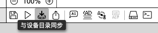
    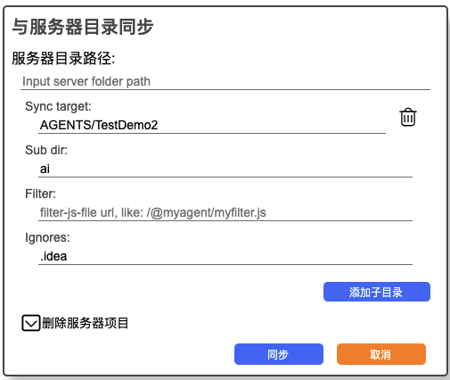
     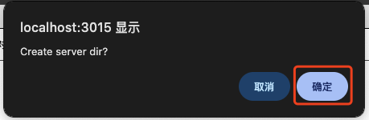

点击`调试 Agent `->`确定`，Agent启动成功。

    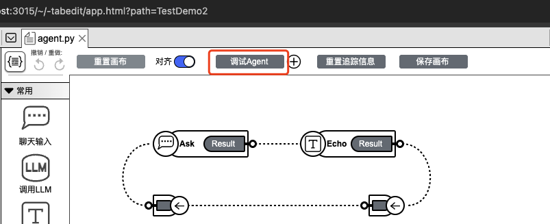
    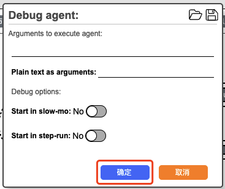
     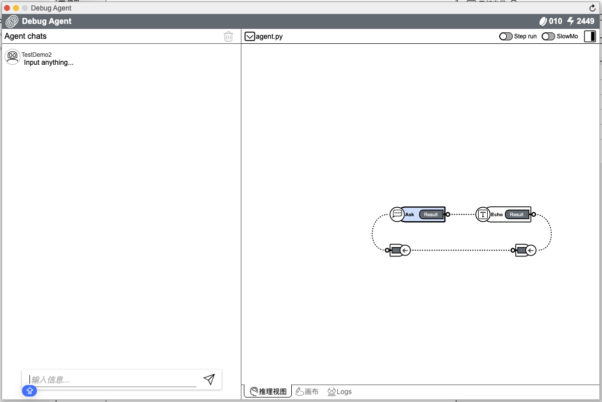

