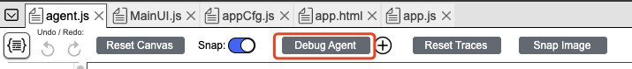
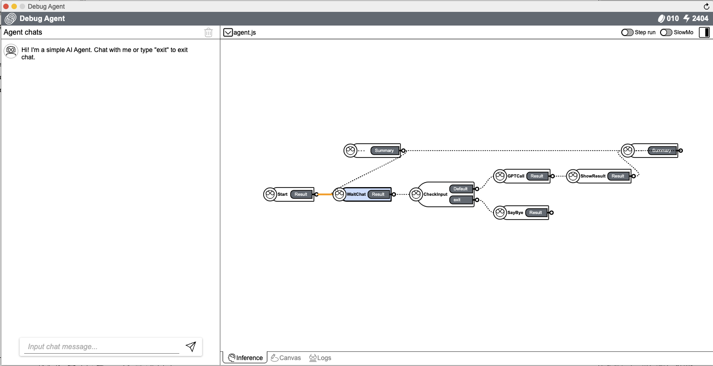
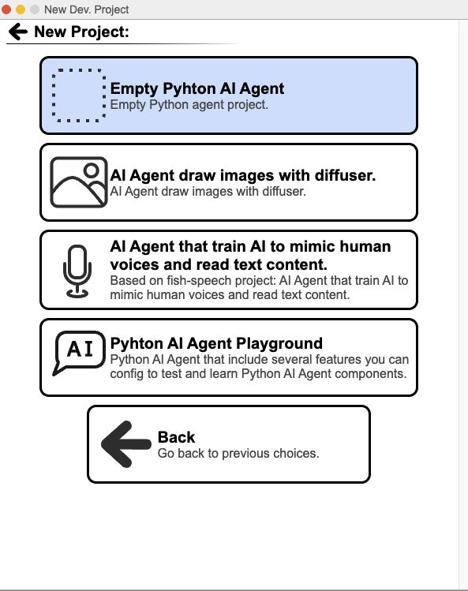
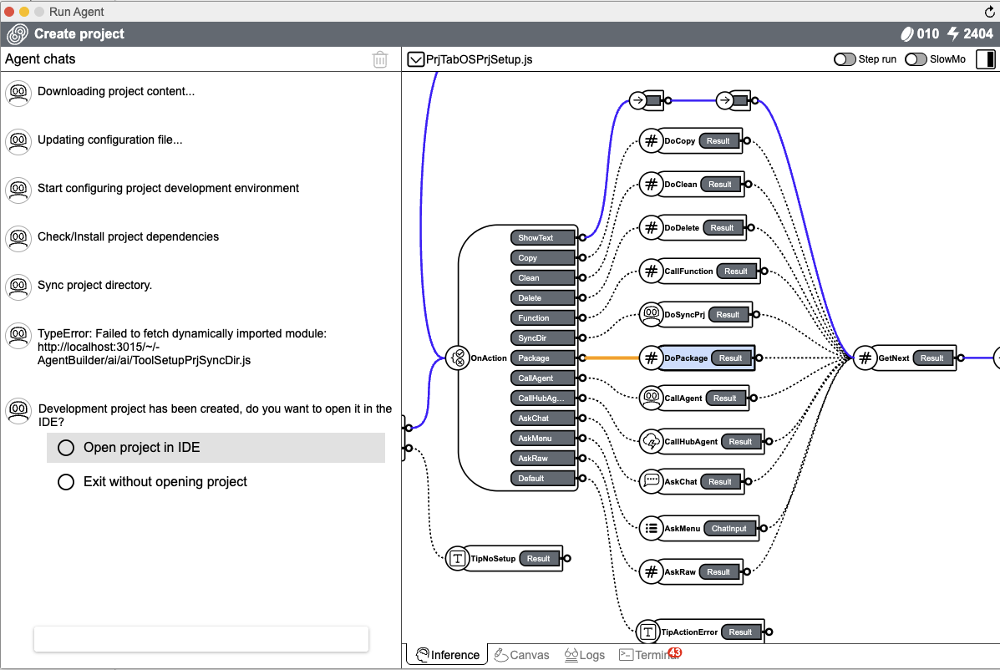

## 📝 Create Project

Click `Development` -> `New Dev. Project`, select project type.

    
    

### 👇 Example

#### 1. Create Browser AI Agent

Click `Browser AI Agent` -> `Simple AI Agent App` -> enter project name (TestDemo3) -> `Create`, the project will be created successfully.

    
    

On the pop-up page, select `Open project in IDE`, the project will be   opened automatically.

    
    

Click `Debug Agent `, the project will start successfully.

    
    

#### 2. Create Backend Python AI Agent

Click `Backend Python AI Agent` -> `Empty Python AI Agent` -> enter project name (TestDemo4) -> `Create`, the project will be created successfully.

    
    
    

On the pop-up page, select `Open project in IDE`, the project will be   opened automatically.

    
    

At the bottom of the page, there is a toolbar. Click `Sync with device` button, type `AGENTS/TestDemo2` in the `Sync target` field, click `Sync` button, then the created project will be synchronized in the local directory.

Click `Debug Agent `, the project will start successfully.

    
    
    

  <a href="../README.md" style="text-decoration: none; color: gray; font-weight: bold;">
    🔗 Back to Home
  </a>

 
