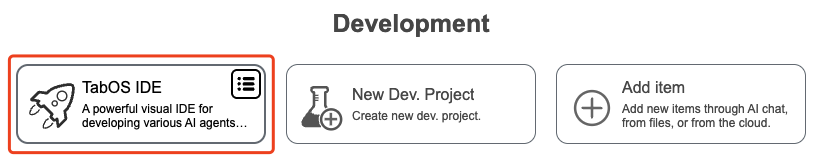
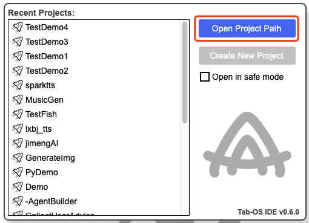
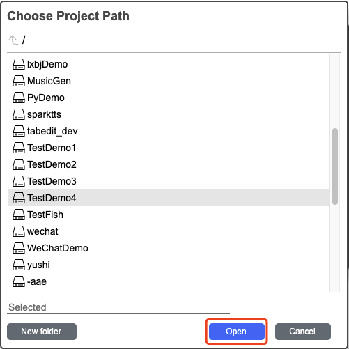
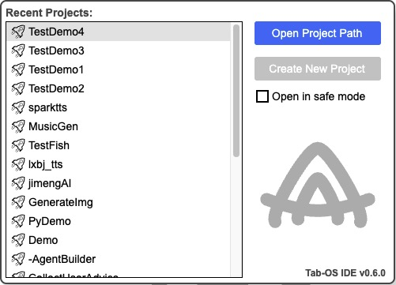

## 🔍 Find Created Project

Click `Development` -> `TabOS IDE`:

- Click `Open Project Path` -> select created project (TestDemo4) -> Click `Open`.

- In the `Recent Projects` list, click the project you want to open (TestDemo4).

  <a href="../README.md">
    🔗 Back to Home
  </a>

 
