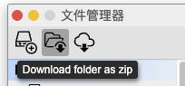

## 发布 Agent

### 确认输出信息

- 请确认你的项目可以正确运行。

- **App**：App 的入口必须是 `.html` 文件。如果你的项目要注册 App 到 AI2Apps，确保你有正确的 html 文件入口。

- **智能体**：如果你的项目要注册 Agent 到 AI2Apps 系统，一定打开 Agent 的`输出智能体`选项。

### 准备安装脚本

#### setup.js

- 在安装 App/Agent 时，会读取项目下的 `./setup.js` 文件，调用这个文件的默认输出的函数，得到并执行安装步骤脚本。

- 通常 App 和在前端运行的 Agent 是无需编写 `./setup.js` 文件的。如果项目内容在 Tab-OS 里部署后还需要一些额外逻辑/操作要执行，可以写在 `./setup.js` 脚本里。

- 对于后端执行的 Agent，首先应该在 `./setup.js` 里增加同步文件的步骤。

- 如果后端的 Agent 需要执行部署过程，在 `./setup.js` 也要添加调用部署项目的 AI 智能体。

- 后端 Agent 的 `setup.js` 模版如下：

```js
import pathLib from "/@path";
let $ln="EN";
async function setupAgent(session,path,lan="EN"){
	let steps,dirName,nodeDirPath;
	$ln=lan;
	dirName=pathLib.basename(path);
	async function checkEnv(session){
		return true;
	}
	steps={
		"start":{
			"action":"Info",
			"description":"开始安装智能体项目",
			"next":(output)=>{return "ensurePackages"}
		},
		"ensurePackages":{
			"action":"Pkg",
			"packages":["AgentBuilder"],
			"description":(($ln==="CN")?("检查/安装项目依赖"):/*EN*/("Check/Install project dependencies")),
			"next":"syncDir",
		},
		"syncDir":{//同步文件到后端
			"action":"SyncDir",
			"dir":"ai",
			"target":dirName,
			"next":(result)=>{
				nodeDirPath=result.agentDir;
				if(nodeDirPath.startsWith("AGENTS/")){
					nodeDirPath=nodeDirPath.substring("AGENTS/".length);
				}
				steps["callStepUpAgent"].args={"prjPath":nodeDirPath};
				return "callStepUpAgent"
			}
		},
		"callStepUpAgent":{
			"action":"CallHubAgent",
			"agentNode":"AgentBuilder",
			"agent":"PrjSetupPrjByStep.js",
			"args":null,//Will be set on running...
			"next":null
		}
	};
	return steps;
}

```

#### 后端部署脚本 

如果你的后端 Agent 安装时需要进一步部署（例如初始化 conda 环境、安装 brew/npm/pip 依赖、下载 hf 模型等），需要在后端 Agent 的目录里有 `setup_agent.js` 或者 `setup_guide.md` 文件用于指导项目部署。具体请参考后端项目部署指南。

### 填写 disk.json

- 以下是计算器 App 的 `disk.json`:

```json
	{
		"imports": {
			"StdUI": "V1",
			"cokemake": "v1",
			"terser": "v1",
			"rollup": "v1"
		},
		"toolExport": [
			{
				"type": "Agent",
				"filePath": "./ai/execMath.js"
			},
			{
				"type": "App",
				"filePath": "./app.html",
				"name": {
					"EN": "Calculator",
					"CN": "计算器"
				},
				"description": {
					"EN": "Calculator App.",
					"CN": "计算器程序。"
				},
				"icon": "cal.svg",
				"package": "CalApp",
				"appFrameW": 400,
				"appFrameH": 600,
				"group": "Tools"
			}
		],
		"cloudId": "CalApp@avdpro@me.com",
		"versionIdx": 2,
		"version": "0.0.1"
	}
```

- **设置依赖**：在 Terminal 里当前的项目目录下，执行 `pkg import [package-name]` 来向`disk.json` 里添加当前工程的依赖项目。请确保项目依赖的非系统 package 在 `disk.json` 的import 对象里都已经声明了。

- **执行入口**：在 `disk.json` 的 toolExport 对象里添加 App/Agent 安装后向 AI2Apps 系统添加的 App/Agent 入口。

	- 不论是 App 还是 Agent，都必须有 `filePath` 属性，填入 App 或 Agent 的入口文件。在 AI2Apps 系统内入口文件的完整路径是区分不同 App/Agent 的唯一标识。
	
	- **APP**：如果是 App，需要详细填写详细的信息，包括名称、功能描述、图标、启动尺寸等。
	
	- **Agent智能体**：如果是 Agent，只需要提供入口 Agent 的 js 文件的相对路径即可。系统会读取文件的 `API输出` 信息。

- **图标**：图标如果是在 `/-tabos/shared/assets/` 目录下，可以直接使用文件名（例如："icon": "app.svg"）。如果图标是相对于当前项目等路径，请用`./`开头（例如："icon":"./icon/AppIcon.svg"）。

### 下载项目 zip 包

点击`文件管理器`，选中当前项目，点击 `Check out from cloud`，下载当前目录的 zip 包备用。



### 发布项目

- 点击侧边栏上的用户图标 -> 点击`管理帐户` -> 

<div></div>
<div></div>
