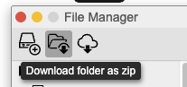
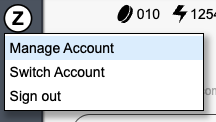
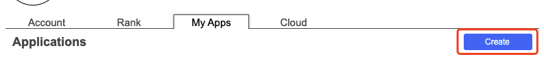
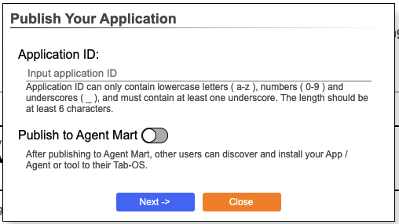
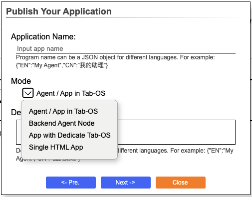
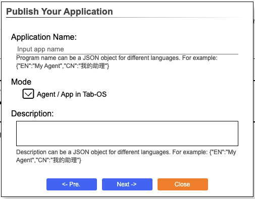
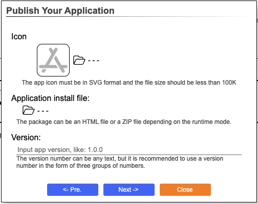
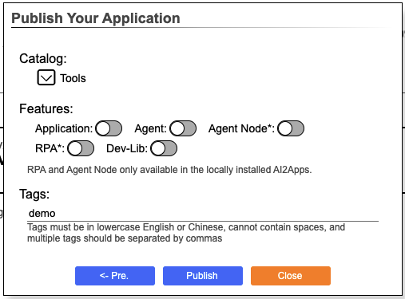
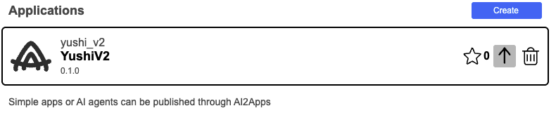

## Publish Agent

### Confirm the Output Information

- Please make sure your project works correctly.

- **App**: The entry of App must be a `.html` file. If your project is going to register App, please make sure you have the correct html file entry.

- **Agent**: If your project is going to register Agent, please open the option `Export as Add on` in AI Agent `object properties`.

<div></div>

### Install Script 

#### setup.js

- When installing App or Agent, it will read the `./setup.js` file in your project and call the default output function from this file, then you can get the installation step and execute the installation script.

- Usually, the App and Agent running on the front end do not need to write `./setup.js` file. If project. If the project content needs some additional logic or operations to be performed after being deployed in Tab-OS, it can be written in the `./setup.js` file.

- If the Agent runs on the backend, you should add the step of sync files in the `./setup.js` file.

- If the backend Agent needs to perform the deployment process, you should add the AI agent that can call the deployment project in the `./setup.js` file.

-  The `./setup.js` template of the backend Agent is as follows:

```js
import pathLib from "/@path";
let $ln="EN";
async function setupAgent(session,path,lan="EN"){
	let steps,dirName,nodeDirPath;
	$ln=lan;
	dirName=pathLib.basename(path);
	async function checkEnv(session){
		return true;
	}
	steps={
		"start":{
			"action":"Info",
			"description":"开始安装智能体项目",
			"next":(output)=>{return "ensurePackages"}
		},
		"ensurePackages":{
			"action":"Pkg",
			"packages":["AgentBuilder"],
			"description":(($ln==="CN")?("检查/安装项目依赖"):/*EN*/("Check/Install project dependencies")),
			"next":"syncDir",
		},
		"syncDir":{
			"action":"SyncDir",
			"dir":"ai",
			"target":dirName,
			"next":(result)=>{
				nodeDirPath=result.agentDir;
				if(nodeDirPath.startsWith("AGENTS/")){
					nodeDirPath=nodeDirPath.substring("AGENTS/".length);
				}
				steps["callStepUpAgent"].args={"prjPath":nodeDirPath};
				return "callStepUpAgent"
			}
		},
		"callStepUpAgent":{
			"action":"CallHubAgent",
			"agentNode":"AgentBuilder",
			"agent":"PrjSetupPrjByStep.js",
			"args":null,//Will be set on running...
			"next":null
		}
	};
	return steps;
}
```

#### Backend Deployment Scripts

If your backend Agent installation requires further deployment, such as initializing the conda environment, installing brew/npm/pip dependencies, downloading hf models and more, the `./setup_agent.js` or `setup_guide.md` file must be in the directory of the backend Agent. This is used to guide the project deployment. 

For details about the deployment, please see [deployment guide]().

### Edit disk.json

- The `disk.json` of `Calculator App` is as follows:

```json
	{
		"imports": {
			"StdUI": "V1",
			"cokemake": "v1",
			"terser": "v1",
			"rollup": "v1"
		},
		"toolExport": [
			{
				"type": "Agent",
				"filePath": "./ai/execMath.js"
			},
			{
				"type": "App",
				"filePath": "./app.html",
				"name": {
					"EN": "Calculator",
					"CN": "计算器"
				},
				"description": {
					"EN": "Calculator App.",
					"CN": "计算器程序。"
				},
				"icon": "cal.svg",
				"package": "CalApp",
				"appFrameW": 400,
				"appFrameH": 600,
				"group": "Tools"
			}
		],
		"cloudId": "CalApp@avdpro@me.com",
		"versionIdx": 2,
		"version": "0.0.1"
	}
```

- **Set Dependencies**: Please open the `Terminal` in the current project, type `pkg import [package-name]` in the terminal panel to add the dependencies to `disk.json` file. Please make sure that the non-system packages of the project are declared in the import object of `disk.json`.

- **Execution Entry**: Please add an App and Agent to the `toolExport` object.

    - Both App and Agent must have a `filePath` attribute. And the attribute is used to fill in the entry file of the App or Agent. In AI2Apps system, the full path of the entry file is used to distinguish different app or agent, it is a unique identification.

    - **APP**: About App, you need to fill in detailed information, including name, function description, icon, size, etc.

    - **Agent Agent**: About Agent, you need to provide the js file's relative  path of the entry Agent, and the AI2Apps sysytem will read the file's API output information.

- **Icon**: If the icon is in the `/-tabos/shared/assets/` directory, you can use the file name directly, such as `"icon": "app.svg"`. If the icon is in a relative path to the current project, please start with `./ `, such as `"icon":"./icon/AppIcon.svg"`.

### Download the Project Zip Package

Click `File Manager`, select the current project, click `Download folder as zip`, download the zip package for backup.



### Publish Project

- Click the user icon on the sidebar -> click `Manage Account` -> click `My Apps` -> click `Create`.

<div></div>
<div></div>

- Type text in `Application ID`, the text represents a unique identification of the published project, not the application's name. Then, open `Publish to agent Mart` and click `Next ->`.

<div></div>

- Type text in `Application Name` -> select `Mode`. If you want the Agent running in the backend, please select `Backend Agent Node`. Otherwise, please select `Agent/App in Tab-OS`.

<div></div>

- Type text about Agent/App in `Descrition`.

<div></div>

- Select the icon for the Agent/App, the icon will be displayed in the `Tool Mart`. Then, choose the downloaded zip package as `Application install file` and type text in `Version`. Finally, click `Next ->`.

<div></div>

- Select `Category` and `Features`, type text in `Tags`, then click `Publish` to publish the Agent/App to the `Tool Mart`.

<div></div>

### Install Agent

For details, please see [tool mart](./too_mart-zh_CN.md).

### Upgrade Agent

To upgrade an Agent, you need to prepare zip package of the Agent. Click the user icon on the sidebar -> click `Manage Account` -> click `My Apps` -> select the Agent/App to upgrade -> click the upgrade icon, update the Agent release information, you can release the new version.

> Note: The new version number must be larger than the old version number.

<div></div>

<p align="right" >
  <a href="../README.md">
    🔗 Back to Home
  </a>
</p> 

