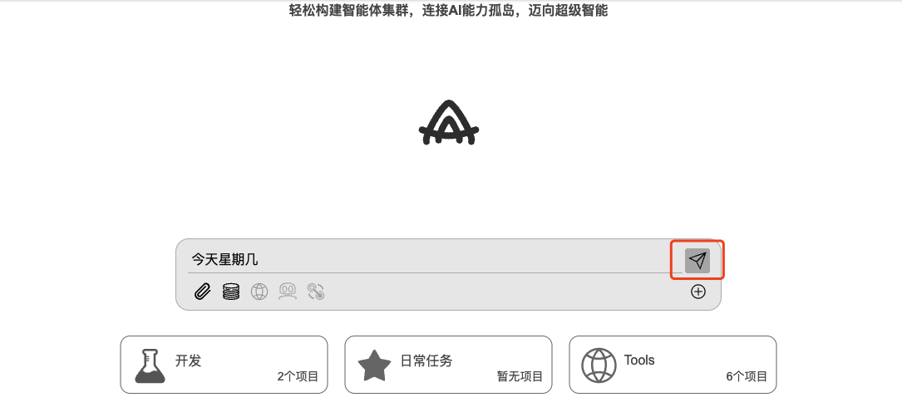
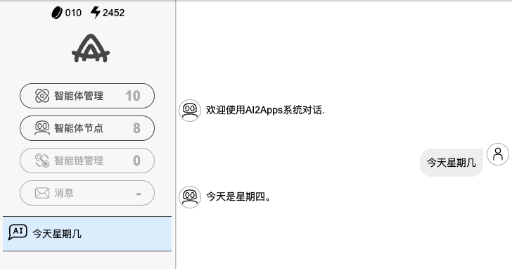
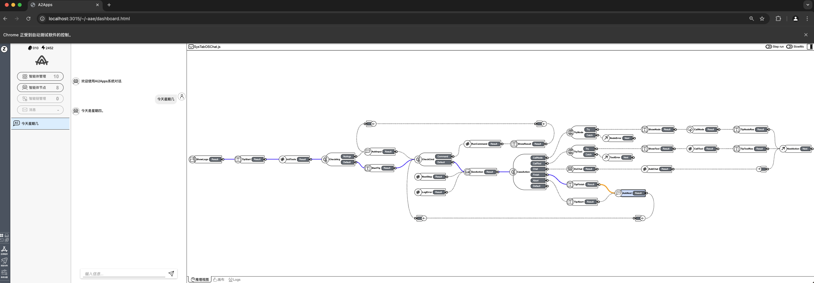

## 💬 简单对话

在dashboard页面输入框内，输入“今天星期几”，点击发送按钮。

    

ai2apps进入对话页面，并展示具体聊天内容与工作流。

    
    

  <a href="../README-zh_CN.md" style="text-decoration: none; color: gray; font-weight: bold;">
    🔗 返回主页
  </a>

