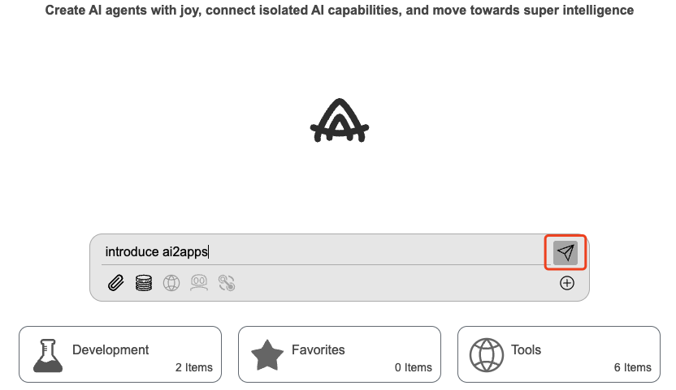
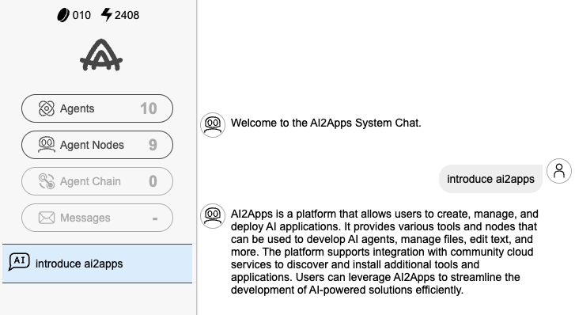
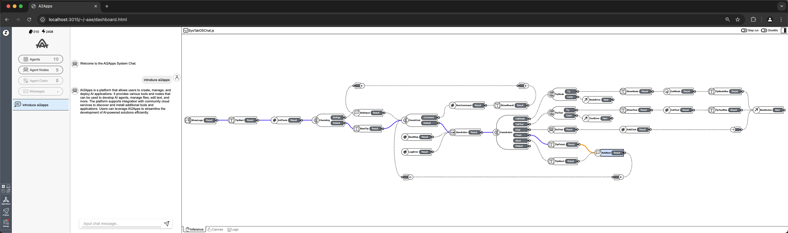

## 💬 Basic Function

In the input field, type "introduce ai2apps" and click the send button.

Then, ai2apps will show the conversation page, including the specific chat content and workflow.

    
    

  <a href="../README-zh_CN.md" style="text-decoration: none; color: gray; font-weight: bold;">
    🔗 返回主页
  </a>

