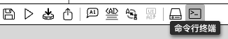
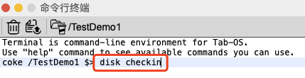
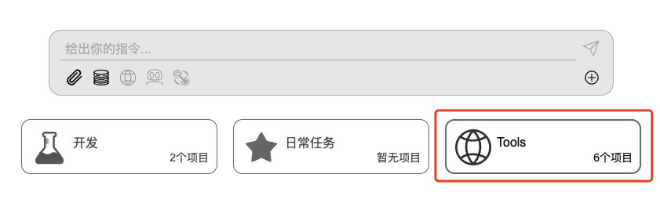
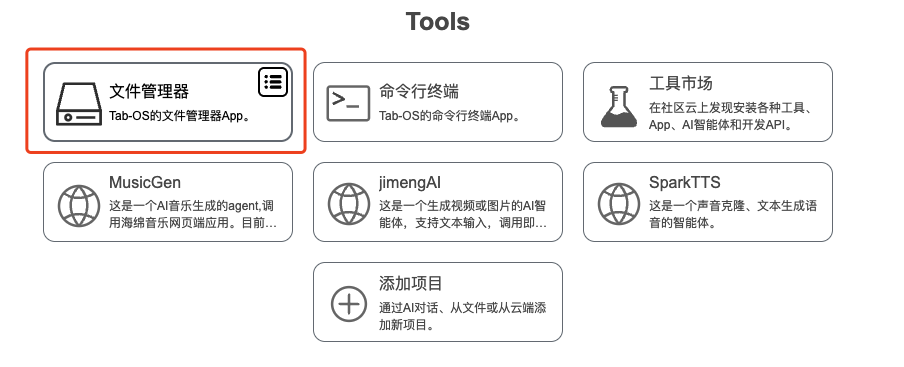
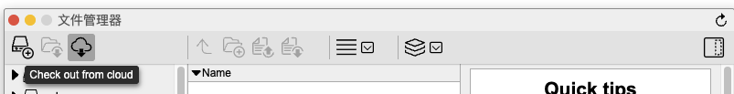
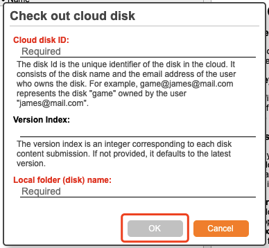

## 👥 团队协作

在页面底部工具栏区域，点击`命令行终端`按钮，在弹出框内输入如下命令。
<div></div>

#### 上传本地项目

<div></div>

```bash
disk checkin
```

#### 更新本地项目至云端

```bash
disk commit
```

#### 同步云端项目

```bash
disk update
```

#### 添加项目成员

```bash
disk addmb
```

#### 获取云端项目

在dashboard页面，点击 `Tools` -> 点击`文件管理器 -> 点击 `Check out from cloud` -> 输入 `Cloud disk ID` 和 `Local folder (disk) name` -> 点击 `OK` 即可。

<div></div>
<div></div>
<div></div>
<div></div>


<p align="right" >
  <a href="../README-zh_CN.md">
    🔗 返回主页
  </a>
</p>