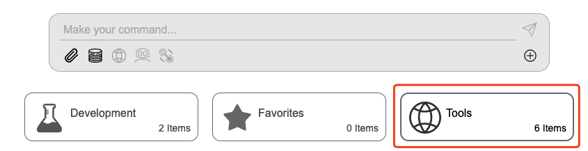
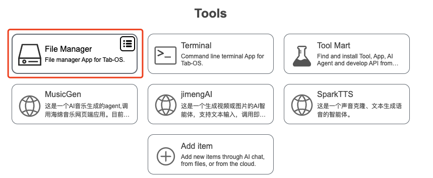
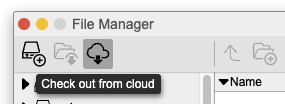
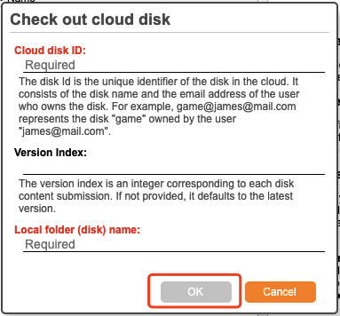

## 👥 Teamwork

At the bottom of the page, there is a toolbar, click `Terminal` button, then type the following codes in the pop-up box.
<div></div>

#### Upload Local Project to Cloud

<div></div>

```bash
disk checkin
```

#### Commit Local Project to Cloud

```bash
disk commit
```

#### Update Cloud Project

```bash
disk update
```

#### Add Team Member

```bash
disk addmb
```

#### Get Cloud Project

In dashboard page, click `Tools` -> click `File Manager` -> click `Check out from cloud` -> type `Cloud disk ID` and `Local folder (disk) name` -> click `OK`. 

<div></div>
<div></div>
<div></div>
<div></div>

<p align="right" >
  <a href="../README.md">
    🔗 Back to Home
  </a>
</p> 
