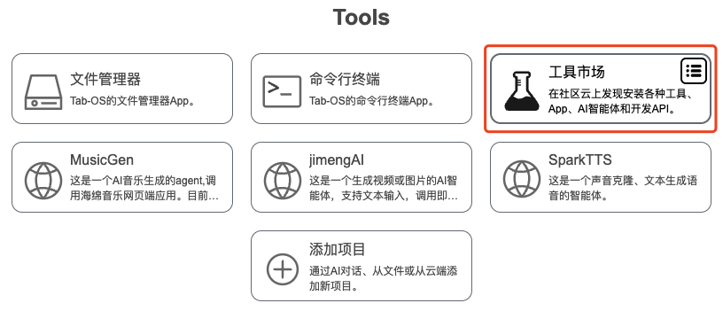
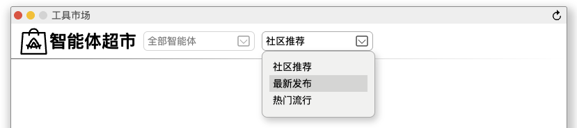
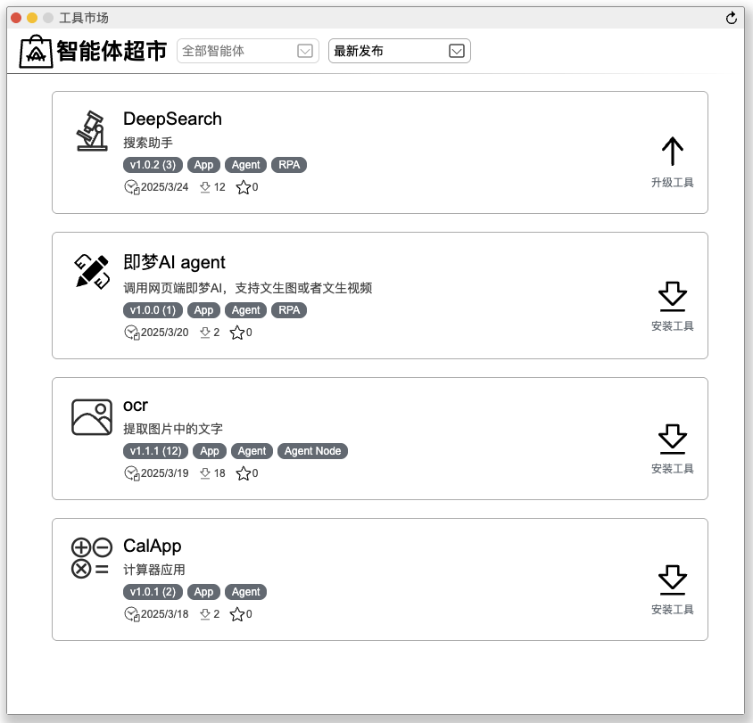
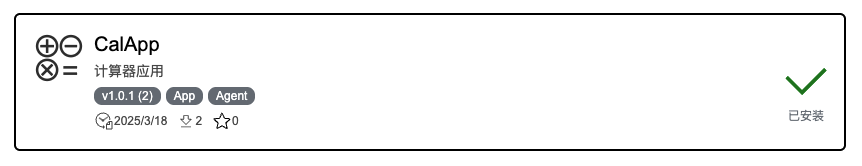
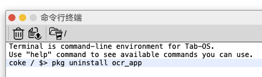

## 🧰 市场工具

### 安装智能体

点击`Tools` -> 点击`工具市场` -> 选择`最新发布`，显示智能体列表。

选择需要的智能体（例如：CalApp），点击`安装工具`，等待安装。

安装完成后，在弹出页面点击`确定`即可。

### 卸载智能体

点击`Tools` -> 点击`命令行终端` -> 输入 `pkg uninstall 项目名称`。例如，在工具市场中的名字为 `ocr`，找到本地文件 `-ocr_app`，在`命令行终端`内输入 `pkg uninstall ocr_app` 即可。

