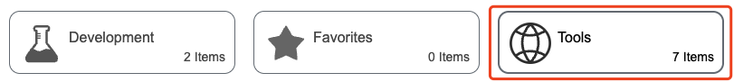
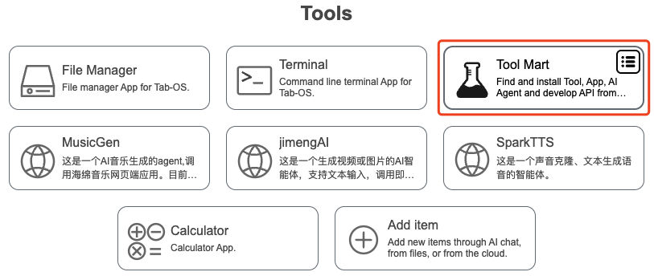
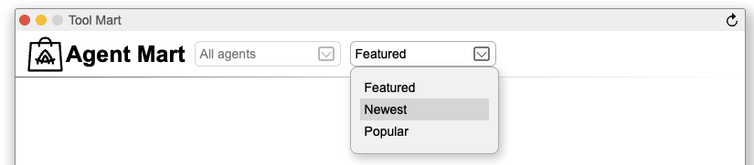
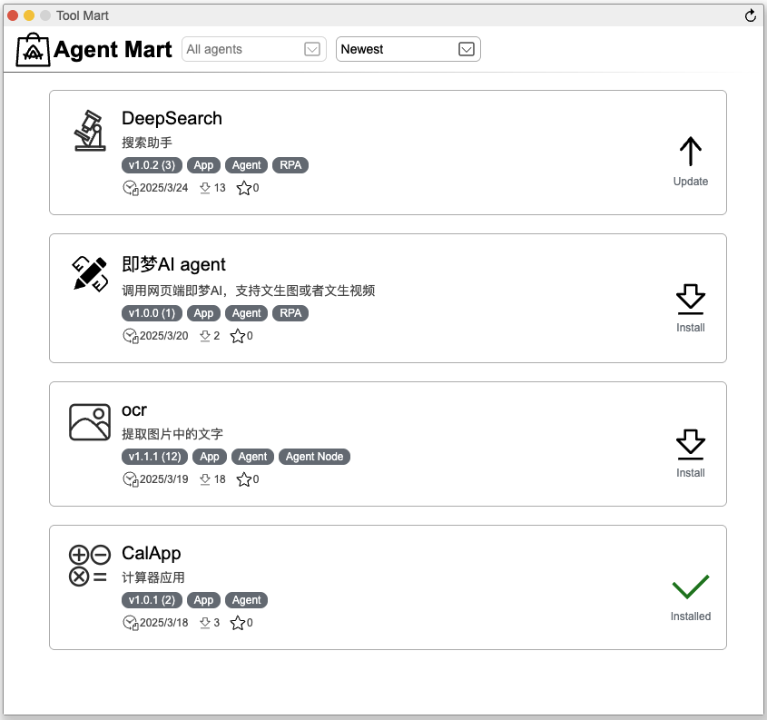
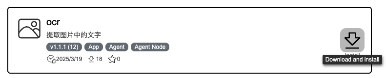
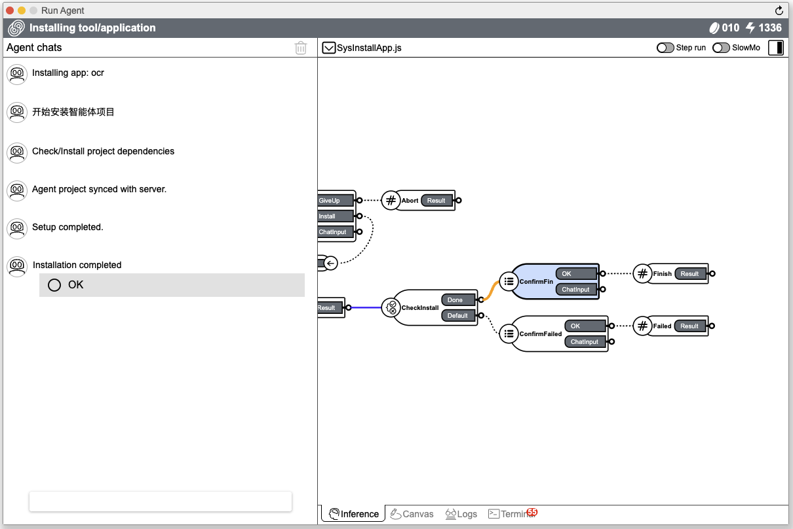
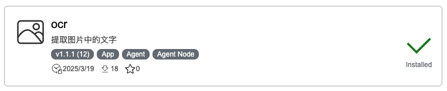
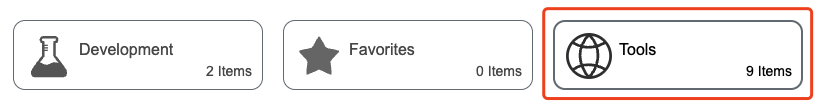
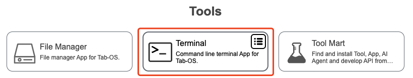
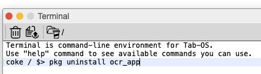

## 🧰 Tool Mart

### Install Agent

Click `Tools` -> click `Tool Mart` -> select `Featured` or `Newest`, agent lists will be displayed.

Select the agent(ocr) you want from the agent lists, then click `Install` and wait for  the installation.

After installation is complete, click `OK` in the pop-up box.

### Uninstall Agent

Click `Tools` -> click `Terminal` -> type `pkg uninstall project_name`. For example, the project name in `Tool Mart` is `ocr`, you need to check the local file `-ocr_app`, then type `pkg uninstall ocr_app` in `Terminal`.

  <a href="../README.md">
    🔗 Back to Home
  </a>

 
