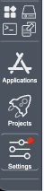

## 🔄 Update System

Click `Settings` button in the left corner of dashboard page, then click `Update System Packages` button to complete the update operation.

    
    

  <a href="../README.md">
    🔗 Back to Home
  </a>

 
