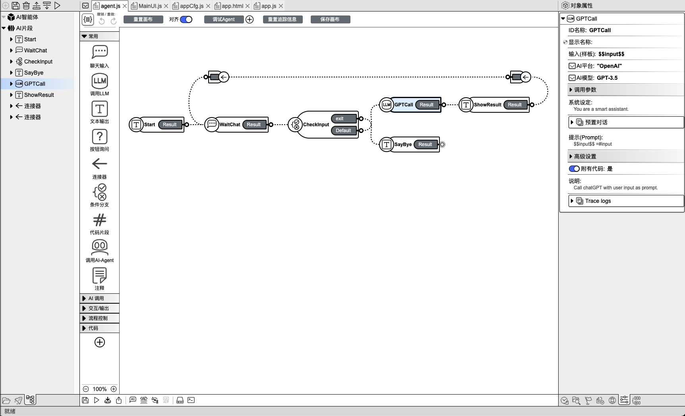
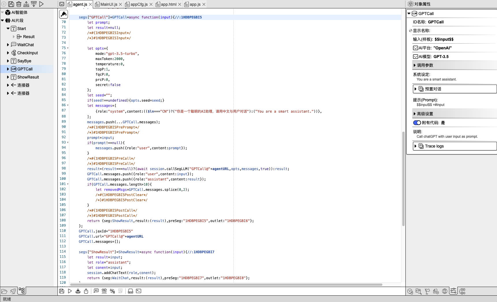
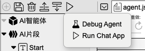
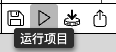
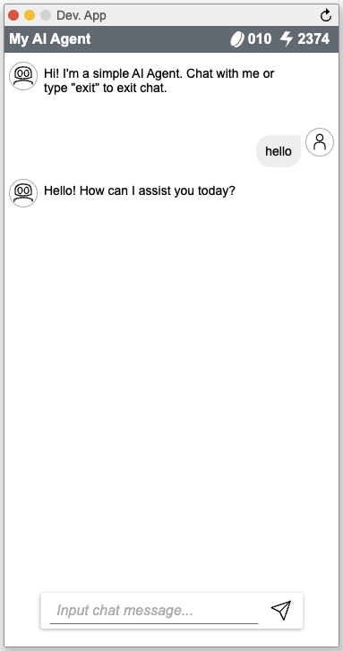
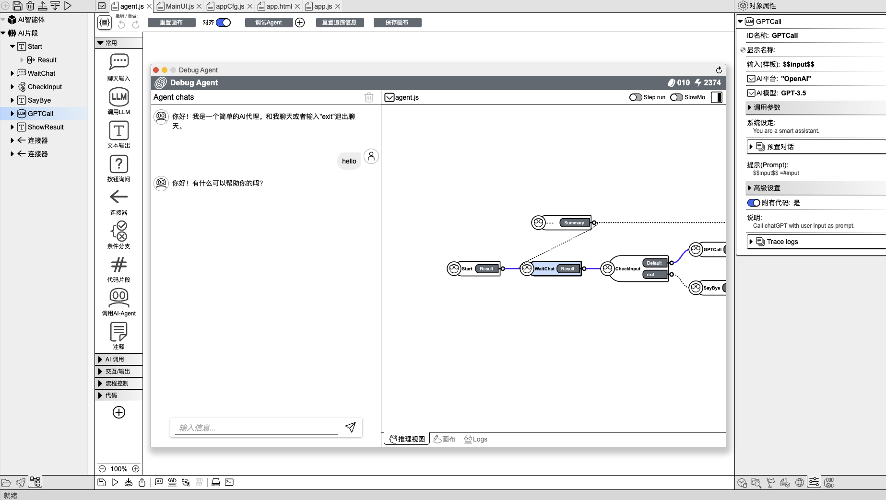
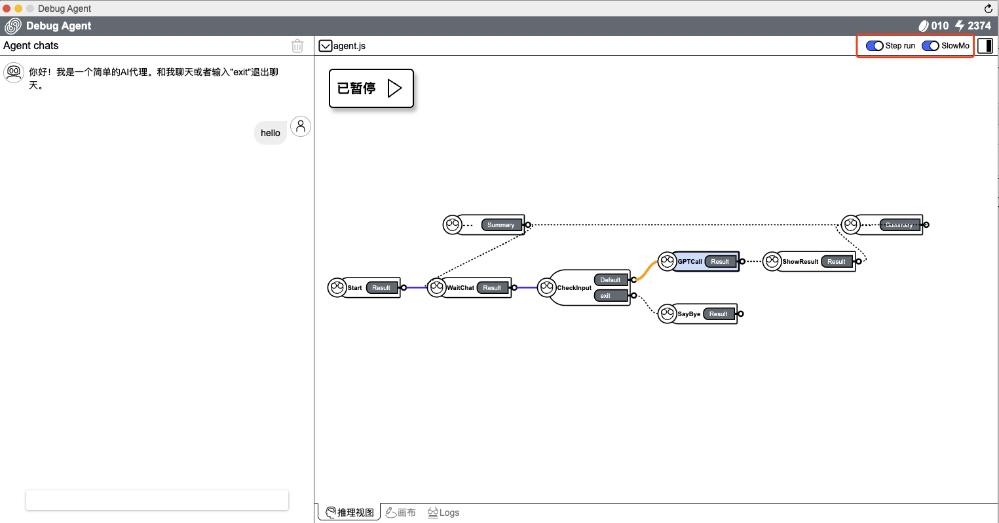
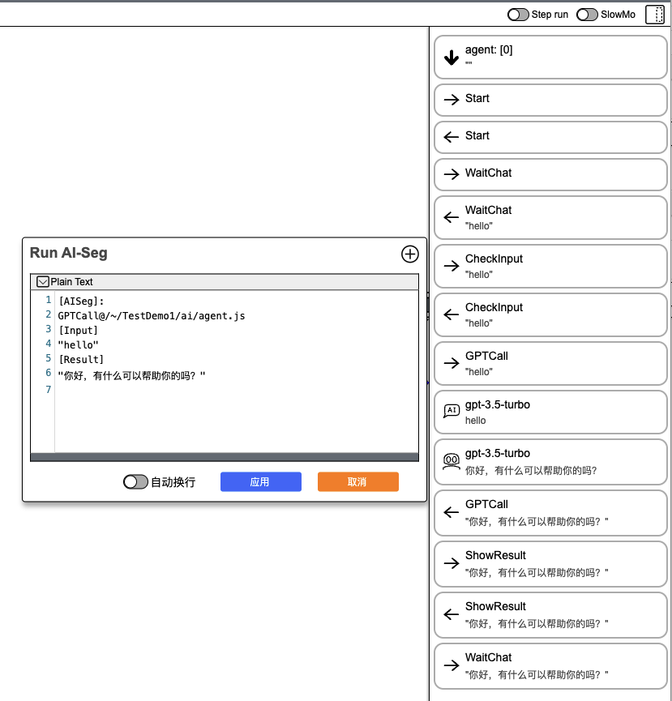

## 📝 使用 IDE  

### 基础介绍

在AI2Apps中，每个 Agent 是一个独立的 js 文件，拓扑图信息以注释的形式保存在文件末尾，
从而保证了设计与实现随时同步。 
 
Agent文件编辑界面有`代码`和`画布`两种模式，打开 Agent 后默认进入画布模式。

#### 1. 画布模式

开发 IDE 在`画布`模式下：

  

> 图片左侧：Agent 的组织结构视图，这里显示 Agent 对象以及其包含的`执行片段`对象列表，点击项目可以选中对象。 

> 图片中间：Agent 拓扑图画布，在这里可以通过拖拽组件来创建`执行片段`对象，并通过拖拽把各个片段之间连接起来。  

> 图片右侧：对象属性编辑器视图，在这里会列出当前选中的对象的可编辑属性，例如调用 ChatGPT 时的模型选择、温度参数等。

#### 2. 代码模式

开发 IDE 在`代码`模式下：  

  

> 图片左侧、右侧：依然是 Agent 的组织结构与对象属性编辑视图。

> 图片中间：Agent 的详细代码。 当编辑 Agent 拓扑图以及对象属性时，代码会自动更新。另外，开发者也可以自己手动编写代码，用于实现可视化编辑无法完成的逻辑。

### 运行\调试 Agent

### 1. 运行 

在 IDE 左上角或顶部工具栏区域，点击`运行项目`按钮 -> `Run Chat App`，即可运行当前的 Agent 项目。

  
  

  

### 2. 调试

点击`调试 Agent` ->`确定`，即可以调试模式启动 AI Agent。

  

点击 `Step run` 或 `SlowMo` 可设置断点或进入缓慢调试模式。另外，推理视图区域，可以看到执行过程，蓝色线条代表该过程已经执行，黄色线条代表正在执行中。

  

点击 `Logs`，可以查看详细的对话流程，每一步`输入`和`输出`的内容。

  
  

  <a href="../README-zh_CN.md">
    🔗 返回主页
  </a>

