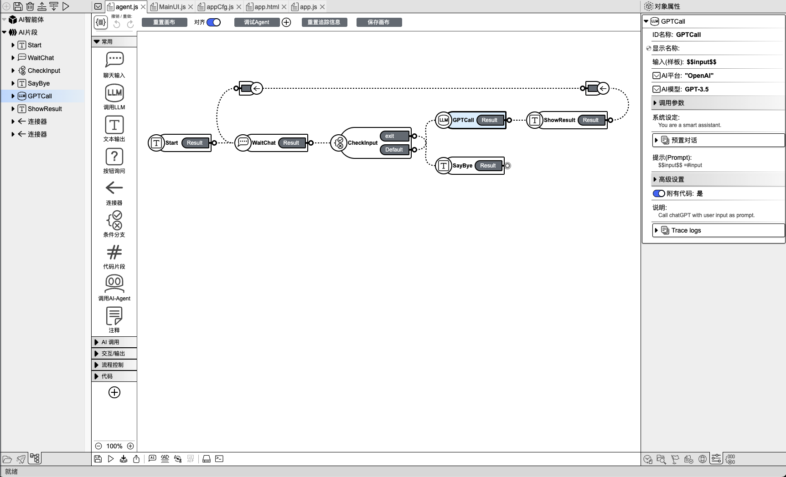
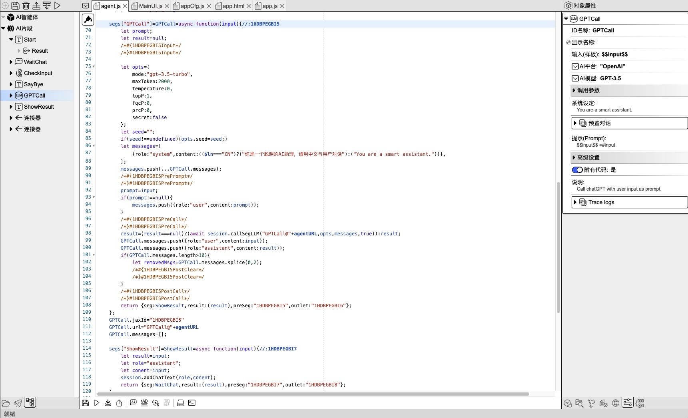

## 📝 Use IDE

### Basic Introduction

In AI2Apps, each Agent is an independent js file, and the topology map information is saved in the form of comments at the end of the file, ensuring real-time synchronization between design and implementation.

The Agent file editing interface offers both `Code` and `Canvas` modes, with `Canvas` mode as the default upon opening an Agent.

#### 1. 画布模式

开发 IDE 在`画布`模式下：

  

> 图片左侧：Agent 的组织结构视图，这里显示 Agent 对象以及其包含的`执行片段`对象列表，点击项目可以选中对象。 

> 图片中间：Agent 拓扑图画布，在这里可以通过拖拽组件来创建`执行片段`对象，并通过拖拽把各个片段之间连接起来。  

> 图片右侧：对象属性编辑器视图，在这里会列出当前选中的对象的可编辑属性，例如调用 ChatGPT 时的模型选择、温度参数等。

#### 2. 代码模式

开发 IDE 在`代码`模式下：  

  

> 图片左侧、右侧：依然是 Agent 的组织结构与对象属性编辑视图。

> 图片中间：Agent 的详细代码。 当编辑 Agent 拓扑图以及对象属性时，代码会自动更新。另外，开发者也可以自己手动编写代码，用于实现可视化编辑无法完成的逻辑。

### 运行\调试 Agent

### 1. 运行 

在 IDE 左上角或顶部工具栏区域，点击`运行项目`按钮 -> `Run Chat App`，即可运行当前的 Agent 项目。

  
  

  

### 2. 调试

点击`调试 Agent` ->`确定`，即可以调试模式启动 AI Agent。

  

点击 `Step run` 或 `SlowMo` 可设置断点或进入缓慢调试模式。另外，推理视图区域，可以看到执行过程，蓝色线条代表该过程已经执行，黄色线条代表正在执行中。

  

点击 `Logs`，可以查看详细的对话流程，每一步`输入`和`输出`的内容。

  
  

  <a href="../README.md">
    🔗 Back to Home
  </a>

 
