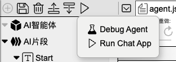
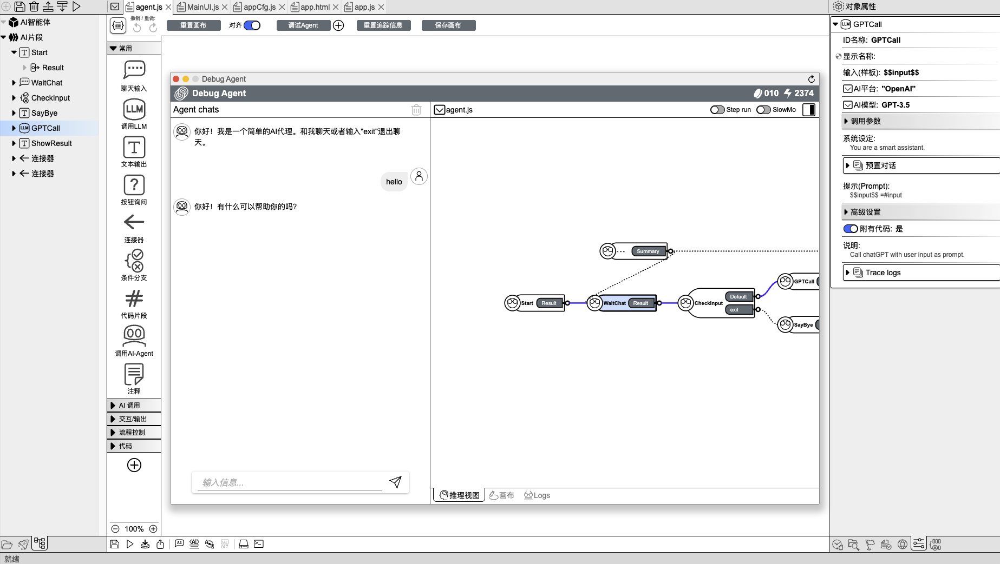
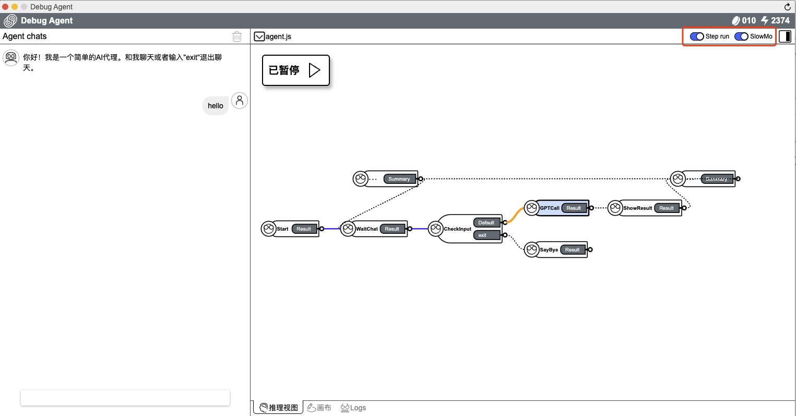
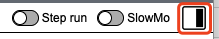
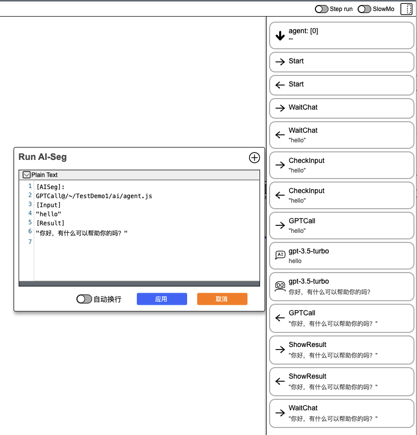

## 📝 Use IDE

### Basic Introduction

In AI2Apps, each Agent is an independent js file, and the topology map information is saved in the form of comments at the end of the file, ensuring real-time synchronization between design and implementation.

The Agent file editing interface offers both `Code` and `Canvas` modes, with `Canvas` mode as the default upon opening an Agent.

#### 1. Cavas Mode

In the Canvas mode of the development IDE:  

  

 
> In the left of the picture: there is the organizational view of the Agent. Here, you can see the Agent objects and the list of "execution segments" they contain. Clicking on a project selects the object.

> In the center of the picture: there's the Agent topology diagram canvas. Here, you can drag and drop to create "execution segments" and connect them together by dragging connections between segments.

> In the right of the picture: there's the object property editor view. Here, editable properties of the currently selected object are listed. For example, parameters like model selection and temperature settings when calling ChatGPT.

#### 2. Code Mode

In the Code mode of the development IDE:    

  

> In the left and right of the picture: there is the organizational structure of the Agent and the object property editing view remain unchanged.

> In the center of the picture: there is the Agent code. When editing the Agent topology diagram and object properties, the code updates automatically. Developers can also manually write code to implement logic that cannot be achieved through visual editing alone.

### Launch\Debug Agent

### 1. Launch Agent 

In the upper left corner of the IDE or the top toolbar area, click the `Run Project` -> `Run Chat App` to run the current Agent project.

  
  

  

### 2. Debug Agent

Click `Debug Agent` -> `OK` to start the current Agent project in debug mode. 

  

Click `Step run` and `SlowMo` can set breakpoints and enter in slow debug mode. In addition, in the inference view area, you can see the execution process. The blue line indicates that the process has been executed, and the yellow line indicates that the process is being executed.

  

Click `Logs`,  you can see the dialogue flow in detail and the input and output content of each step.

  
  

  <a href="../README.md">
    🔗 Back to Home
  </a>

 
